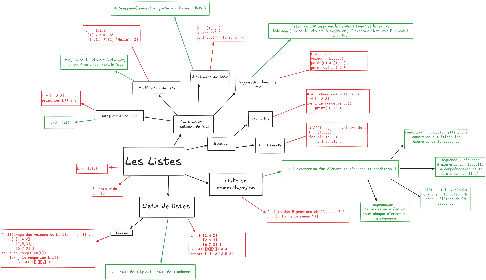

# Les listes

Un tableau (liste) est une structure de données qui permet de stocker plusieurs valeurs (nombres, chaînes, booléens, etc.) dans une seule variable, et d’y accéder grâce à leur position (indice).

- Les listes sont des **séquences** : elles sont ordonnées et itérables.

- Les listes sont **mutables** : elles peuvent être modifiées après leur création.

- Les listes sont **hétérogènes** : elles peuvent contenir tous les types d’objets.

## Carte mentale

    

