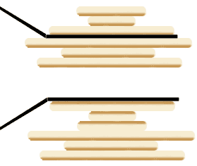
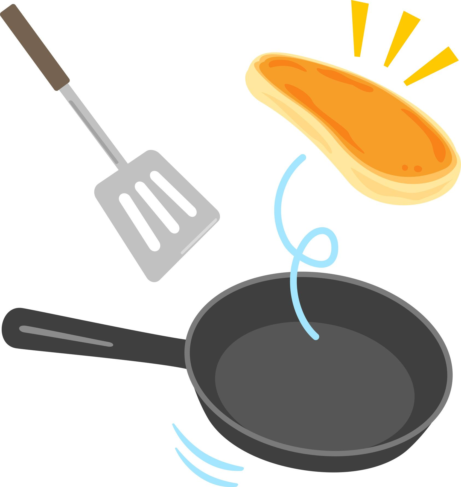

# TP : Le crêpier psychorigide


### Compétences travaillées :

- décrire un processus étape par étape

- détecter les ambiguïtés

- améliorer un algorithme

## Principe du problème

Un crêpier psychorigide possède une pile de crêpes toutes de tailles différentes. Il est de mauvaise humeur car il s'est rendu compte d'un problème très important (pour lui) : **Elles sont dans le désordre.**  

Son rêve à lui, c'est d'obtenir une pile de crêpe trié de la plus grande en dessous à la plus petite au dessus, comme ceci :

```
petite
moyenne
grande
très grande
```

Malheureusement, la liste des problèmes ne s'arrête pas là, il n'a pas d'autre assiettes, rendant impossible le rangement des crêpes au fur et à mesures dans un autre récipient.  

Sa seul solution : **glisser une spatule sous une crêpe et retourner toutes les crêpes au-dessus**.

Voici un exemple d'action que le crépier peut réaliser :

<div style="display: flex; flex-direction:column;  text-align: center; ">
  
</div>

Ici, le crépier insère sa spatule entre la 3ème et 4ème crêpe, et retourne la pile au-dessus. La crêpe juste au-dessus de la spatule se retrouuve donc en haut de la pile de crêpe.

## Activité

Avant de commencer :

- Former des groupes de 2,3 ou 4.
- Préparer un document (feuille papier 🖋️ ou document texte 💻) pour y écrire vos réponses.
- Découper les crêpes sur la feuille distribuée, et mélanger les. Écrire sur votre document-réponse la configuration initiale obtenue, de telle sorte à pouvoir recommencer à tout moment.

### 1er étape

En utilisant les papiers de crêpes, et par tâtonnement, essayer de trier les crêpes de la plus grande à la plus petite.  

👉 Vous pouvez utiliser une règle ou tout autre matériel de votre trousse pour agir à la place de la spatule.

Écrire la procédure pour ranger les 6 crêpes en langage naturel compréhensible par des non-informaticiens. Attention ! Cette procédure va être par la suite lue par d'autres groupes, il faut que chaque action soit compréhensible !

### 2eme étape

Maintenant que votre procédure est prête, faites tester à un autre groupe le tri des crêpes avec votre configuration initiale, puis une autre configuration de crêpe.

### 3eme étape

Est-ce que la procédure que votre groupe à reçu passe les tests ? Ecrire ce qui a marché, ce qui n’a pas marché ou pas bien compris.

## Mise en commun

<div style="display: flex; flex-direction:column;  text-align: center; ">
  
</div>

## Pour les plus rapides

### Il est très psychorigide ce crépier...

Le crépier a une nouvelle manie, il souhaite que le côté bien cuit des crêpes se trouve au-dessus (le côté avec le numéro). 

Que faut-il changer à votre algorithme pour répondre à cette nouvelle exigence ?

### Evaluation de la performance d'un algorithme 

1. Calculer le nombre de coups nécessaires pour ranger la pile des 6 crêpes avec votre algorithme.

2. Dans quel cas le nombre de coups de spatule est maximum ? Minimum ?

3. Essayer de réfléchir pour un nombre non défini `n` de crêpes, combien de coups au maximum, minimum ?


