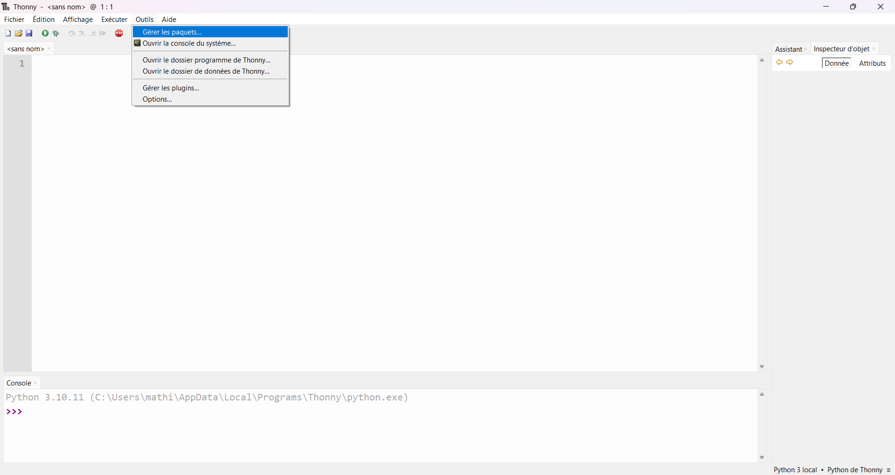
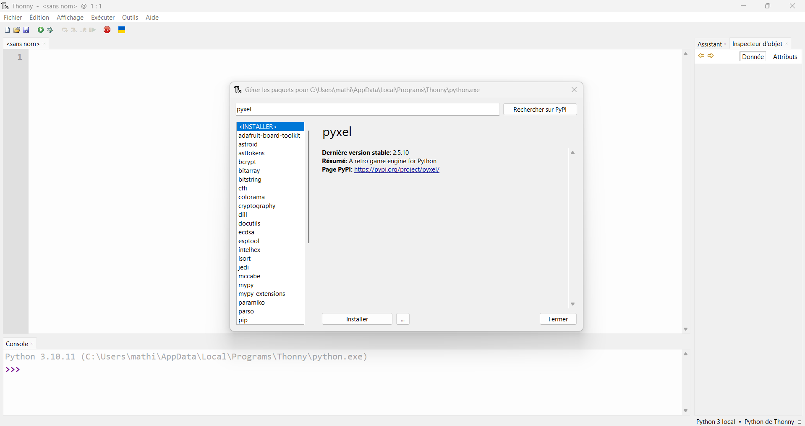

<link rel="stylesheet" href="../../assets/style.css" />
<script src="https://cdn.jsdelivr.net/npm/mathjax@3/es5/tex-mml-chtml.js"></script>

# Bibliotheque Pyxel

## 🎮 Qu’est-ce que Pyxel ?

Pyxel est une bibliothèque Python qui permet de créer facilement des jeux vidéo rétro en pixel-art.
Elle s’inspire des consoles 8 bits comme la NES ou la Game Boy.

Vous pouvez retrouver la documentation et les différents projets existant ici : 


## La bibliothèque Pyxel

La bibliothèque Pyxel n'est pas installé de base sur la version de Python de votre ordinateur. Pour pouvoir l'utiliser, plusieurs solution s'offre a vous :

### Pour Thonny

1. Ouvrez Thonny, puis cliquez sur l'onglet <u>Outil</u> de la barre des tâches.

<div style="display: flex; flex-direction:column;  text-align: center; ">
  
</div>

2. Cliquez ensuite sur <u>Gérer les paquets...</u>, ce qui vous permettra d'ouvrir une boîte de dialogue pour télécharger toutes les bibliothèques et autres paquets sur votre logiciel. 

<div style="display: flex; flex-direction:column;  text-align: center; ">
  
</div>

3. Tappez "pyxel" dans la barre de recherche, et installez la bibliothèque. Vous pouvez maintenant importer la bibliothèque avec l'instruction `import pyxel`.

### Pour Edupython

Edupython fonctionne de manière identique pour ajouter la bibliothèque Pyxel

### Depuis un shell 

Effectuez la commande suivante :

```shell
pip install -U pyxel
```

Puis ajoutez le fichier pyxel.exe au Path de votre machine.

## Architecture d’un programme Pyxel

Un programme Pyxel suit toujours la même structure :

```python
# Importation de la bibliothèque Pyxel
import pyxel

# Création de la page du jeu
class Jeu:
    def __init__(self):
        pyxel.init(160, 120, title="Mon Jeu")  # ouverture de la fenêtre

        # variables du jeu
        self.x = 50
        self.y = 50

        pyxel.run(self.update, self.draw)      # lance le jeu

    def update(self):
        # logique du jeu (déplacements, collisions...)
        pass

    def draw(self):
        # dessin de tout ce qui s’affiche à l’écran
        pass

Jeu()
```

## Modification des images et des pixels

Pyxel Editor peut créer des images (sprites) et des sons utilisés dans votre jeu/animation Pyxel. Vous pouvez démarrer Pyxel Editor avec la commande suivante :

```shell
pyxel edit PYXEL_RESOURCE_FILE
```

Si le fichier de ressources Pyxel spécifié (.pyxres) existe, il sera chargé. S'il n'existe pas, un nouveau fichier avec le nom spécifié sera créé. Si le fichier de ressources est omis, un nouveau fichier nommé my_resource.pyxres sera créé.  
Après avoir démarré Pyxel Editor, vous pouvez passer à un autre fichier de ressources en le faisant glisser et en le déposant sur Pyxel Editor.  

Le fichier de ressources créé peut être chargé en utilisant la fonction load.

## Travail de préparation

Plusieurs créations sont libre d'accès et vous permettront de voir plus en détails le fonctionnement de la bibliothèque Pyxel.

1. Testez plusieurs jeu/animations présentent sur la page github du créateur de Pyxel :  . Vous pouvez récuperer le code de ces projets Pyxel et comprendre le fonctionnement pour chacune.

2. Choisissez l'un de ce jeu/animation et modifiez le code pour que l'on puisse voir une nette différence entre l'original et le votre. Attention, cela ne doit pas bloquer le bon déroulement du jeu. 


## A vous de jouer !

Maintenant que vous vous êtes familiarisés avec les bases de Pyxel, à vous de créer votre propre jeu ou animation ! 