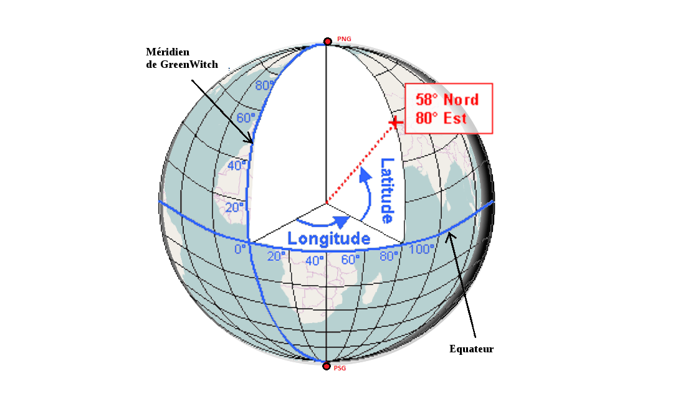

# Données exif d'une photo

## Présentation du TP
Avec les appareils photo récents ou les téléphones portables, lorsqu'une photo est prise, plusieurs informations sont enregistrées en plus de l'image elle-même : on parle de **métadonnées**.  
  
Le plus souvent, le format d'enregistrement de ces informations est l'**EXIF** (Exchangeable Image File Format). Ce format couvre un large éventail d'informations comme la date et l'heure, les réglages de l'appareil, la géolocalisation lorsqu'elle existe...  
  
Dans cette activité, nous allons voir une méthode pour récupérer les informations Exif d'une photo à l'aide de la librairie python Pillow .

## La libraire python Pillow
La bibliothèque Pillow (nouvelle version de l'ancienne bibliothèque PIL) propose de nombreux outils de traitement d'images.  

Lien vers le site officiel :  <a href="https://pillow.readthedocs.io/en/stable/" target="_blank_" >pillow.readthedocs.io/en/stable/</a>

Nous allons nous intéresser à :

- l'ouverture d'une image
- la récupération et l'interprétation des données Exif de l'image

## Importation de la librairie
Comme pour toute librairie, pour pouvoir l'utiliser, il faut qu'elle soit installée dans l'environnement d'exécution de python utilisé.

Pour que les constantes, les fonctions et les méthodes de la libraire soient disponibles, il faut insérer le code suivant.

```python
from PIL import Image
```
## Ouverture et affichage d'une image
Avec la librairie Pillow, l'ouverture et l'affichage d'une image sont simples.  

```python
im = Image.open("nomImage.jpg")   # ouverture de l'image
im.show()   # affichage de l'image dans le logiciel par défaut d'affichage des images
```

## Les données Exif d'une photo
Les informations Exif d'une photo peuvent être récupérées sous la forme d'un dictionnaire à l'aide de la méthode `_getexif()` appliquée à l'image récupérée.  

```python
dico_exif = im._getexif()
```
Les clés sont des nombres (voir ci-dessous) et les valeurs, les informations correspondantes.

Faite un print du dictionnaire pour voir son contenu "brut".

```python
print(dico_exif)
```

### Décryptage des données Exif
La bibliothèque Pillow propose un dictionnaire qui permet de faire la correspondance entre les clés des données Exif et leurs significations. Ce dictionnaire est stocké dans la variable TAGS.
  
Expliquer, sans les tester, ce que font les deux lignes suivantes :

```python
from PIL.ExifTags import TAGS
for c, v in TAGS.items():
    print(str(c) + ' : ' + str(v))
```

### Les données GPS

Les données GPS sont stockées dans le dictionnaire récupéré par la méthode `_getexif()` avec la clé 34853 sous la forme d'un dictionnaire.  
  
La bibliothèque Pillow propose un dictionnaire qui permet de faire la correspondance entre les clés des données GPS et leurs significations. Ce dictionnaire est stocké dans la variable `GPSTAGS` qu'il faudra importer avec la ligne de code suivante.

```python
from PIL.ExifTags import GPSTAGS
```

Les coordonnées de géolocalisation correspondent à la latitude et la longitude. Elles sont exprimées soit dans le système sexagésimal (c'est à dire en base 60, autrement dit en degrés, minutes, secondes) soit dans le système décimal.  


<div style="display: flex; flex-direction:column;  text-align: center; ">
  
</div>

Exemple des coordonnées de la Tour Eiffel :  

- dans le système sexagésimal (degrés/minutes/secondes) : 48°51'30.0"N 2°17'40.1"E
- dans le système décimal : 48.858336N, 2.294471E
 

• Dans les données Exif :  

- la latitude est donnée par une lettre (N ou S) et un tuple de trois tuples,
- la longitude est donnée par une lettre (E ou W) et un tuple de trois tuples.  

Dans les deux cas, les trois tuples correspondent aux degrés, aux minutes et aux secondes avec la précision. Ainsi, le tuples ((48, 1), (51, 1), (3000, 100)) correspond à 48° 51' et 3000/100 = 30,00".

## Travail à faire
Dans votre espace, créer un répertoire pour l'activité en cours.

### Prendre une photo et la transférer sur l'ordinateur
A l'aide de votre téléphone portable :

- activer la géolocalisation,

- paramétrer le téléphone pour que les informations de géolocalisation soient ajoutées aux photos,

- prendre une photo de votre ordinateur,

- transférer la photo dans le répertoire de travail sur l'ordinateur. 

### Récupérer quelques informations générales
Écrire les lignes de code qui permettent d'afficher :

- le **constructeur** et le **modèle** de l'appareil photo (Make et Model)

- la **taille** de l'image (ImageWidth et ImageHeight),

- la **date** et **l'heure** de la prise de la photo (DateTime).

### Récupérer les informations de géolocalisation
Écrire les lignes de code qui permettent d'afficher les **coordonnées GPS** d'une photo dans le **système sexagésimale** et dans le **système décimal**.

Copier/coller ces coordonnées dans un site de cartographie en ligne comme <a href="www.openstreetmap.org" target="_blank_">www.openstreetmap.org</a> .

### Pour aller plus loin
Écrire les lignes de code qui permettent d'afficher l'ensemble des données Exif d'une photo de façon lisible.

Exemple : 
```
Make : ...
GPSInfo : ...
... : ... 
````