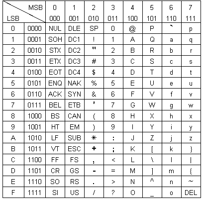
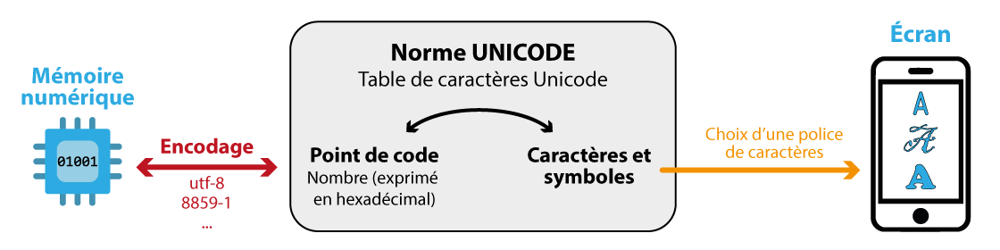

# L'encodage des caractères

<link rel="stylesheet" href="../../assets/style.css" />

## Présentation
### Encodage des caractères
Comme avec les nombres, lorsqu'on souhaite travailler avec des caractères, il est nécessaire d'attribuer un **code binaire** à chacun d'eux. Cela s'appelle **l'encodage**.

Les normes d'encodage ont évoluées, de 128 caractères dans les années 60 avec l'ASCII, on est passé à plus de 100 000 caractères avec les normes actuelles.

### Utiliser un éditeur hexadécimal
Un éditeur hexadécimal est une interface (logiciel, application ou page web) qui permet de visualiser et éditer directement le code d'un fichier.

L'éditeur que nous utiliserons est une page web dont voici le lien : <a href="https://hexed.it/" target="_blank">hexed.it</a>.

## L'ASCII

<div style="border:2px solid #af4c4cff; padding:10px; border-radius:8px">
<strong>Présentation</strong><br>
L'ASCII (American Standard Code for Information Interchange) est la première norme d'encodage des caractères. Elle est apparu dans les années 60 et s'est progressivement généralisée.
</div>

### Table des caractères de l'ASCII
L'ASCII permet le codage de 128 "caractères", chacun d'eux utilisant 7 bits.

<div style="display: flex; flex-direction:column;  border: 1px solid #ccc; text-align: center; border-radius: 8px;">
  
  <span style="font-style: italic; color: gray;">MSB : Most Significant bit ou byte (= bit/octet de poids fort)
 <br>
  LSB : Least Significant Bit ou Byte (= bit/octet de poids faible)
  </span>
</div>


### Lecture du tableau
Les bits de poids forts (MSB, Most Significant Bit) étant en tête de colonne, le tableau ci-dessus s'utilise en commençant par la colonne et en terminant par la ligne.

**Exemple :** le caractère Z sera codé 101 1010 en binaire soit 5A en hexadécimal.

**Remarque :** le tableau précédent existe également avec les lignes et les colonnes inversées.

>## Applications
>1) Donner le code binaire et hexadécimal du caractère H.
>
>2) Donner le caractère qui correspond au code 1010111.
>

## L'encodage ISO-8859-1
### Petit historique

L'ASCII ne permettant pas l'encodage des caractères accentués, en Europe occidentale, une autre norme a été proposée : **l'ISO-8859-1 (parfois appelée Latin-1)**.

Cette norme intègre l'ASCI en lui ajoutant des caractères.

### La table des caractères de l'ISO-8859-1


<div style="display: flex; flex-direction:column;  border: 1px solid #ccc; text-align: center; border-radius: 8px;">
  
  <span style="font-style: italic; color: gray;">D'après la page de Wikipédia sur l'<a href="https://fr.wikipedia.org/wiki/ISO/CEI_8859-1">encode ISO-8859-1</a></span>
</div>

<br>

>## Applications 
>### Application I : Comprendre la lecture de la table 🖋️
>1) D'après la table ci-dessus, sur combien de bits chaque caractère est-il codé ?
>
> **Solution :** Sur 8 bits (1 octet).
>
>2) La norme ISO-8859-1 est-elle compatible avec la norme ASCII.
>
> **Solution :** Oui, les 128 premiers caractères d'ISO-8859-1 correspondent à ceux de l'ASCII.
>
> ### Application II : Encoder un texte 🖋️
>On s'intéresse au texte "Hello !" représentée à l'aide de la norme ISO-8859-1.
>
>1) Indiquer le nombre de bits nécessaires pour encoder ce texte.
>
> **Solution :** 56 bits.
>
>2) Donner la représentation de ce texte en hexadécimal.
>
> **Solution :** En python = 0x48 0x65 0x6C 0x6C 0x6F 0x20 0x21 sur feuille = 48 65 6C 6C 6F 20 21
>
>3) Donner la représentation de ce texte en binaire.
>
> **Solution :** En python = 0b01001000 0b01100101 0b01101100 0b01101100 0b01101111 0b0010000 0b00100001, sur feuille = 01001000 01100101 01101100 01101100 01101111 0010000 00100001 .
>
>=> Vérifier votre réponse avec l'éditeur hexadécimal.
>
> ### Application III : Décoder un code 🖋️
>On s'intéresse au texte encodé à l'aide de la norme ISO-8859-1 dont la représentation en binaire est la suivante :
>
```
0011 1010 0010 1101 0010 1001
```
>
>1) Indiquer le nombre de caractères contenus dans ce texte.
>
> **Solution :** 3 caractères.
>
>2) Retrouver ce texte.
> 
> **Solution :** ":-)"
>


## L'Unicode et ses encodages
### Présentation
Avec l'augmentation de la puissance des machines et de la mémoire disponible, il devient possible d'envisager un encodage universel, c'est le but de la norme Unicode.

### La norme Unicode

<div style="border:2px solid #af4c4cff; padding:10px; border-radius:8px">
<strong>Principe général de la norme Unicode</strong><br>
Le standard Unicode (dans sa version 17.0) constitue un répertoire d'environ 160 000 caractères et symboles d'une centaine de langues.
</div>


A chaque caractère ou symbole est attribué un nombre que l'on appelle **point de code**. Ces points de code sont notés **U+xxxx** (où x est un chiffre hexadécimal). La plage des points de code va de **U+00000** à **U+10FFFF**.

<div style="display: flex; flex-direction:column;  text-align: center; ">
  
</div>

L'unicode ne définit pas la façon dont les points de code vont être représentés en mémoire par des 0 et des 1. Mais alors qui s'en charge ? Ce sont les **encodages UTF**, par exemple :

- UTF-8 (Universal Character Set Transformation Format - 8 bits)

- UTF-16 (Universal Character Set Transformation Format - 16 bits)

- UTF-32 (Universal Character Set Transformation Format - 32 bits)

Chaque encodage explique comment transformer un point de code Unicode en suite de 0 et de 1.

Les représentations des caractères à l'écran sont appelées des **glyphes**. Ces représentations dépend du choix de la police de caractère. Une police donnée ne dispose en général pas de glyphe pour tous les points de code !

### Liste complète des points de code et des symboles associés de la norme unicode
Le lien suivant permet de visualiser la [table Unicode complète](https://symbl.cc/fr/unicode-table/).

Ex : [Lettre majuscule latine A](https://symbl.cc/fr/0041/).

> ### Application IV : Un nombre entier à tout prix 🐍
> On souhaite vérifier que la valeur entrée par l'utilisateur est bien un nombre entier positif.
>
> L'une des méthodes est de tester tous les caractères de la chaine entrée par l'utilisateur et de vérifier leurs points de code unicode.
>
> On précise que les points de code unicode des 10 chiffres de 0 à 9 vont de U+0030 à U+0039.
>
> 1) Écrire une fonction qui prend une chaine de caractère en paramètre et renvoie True ou False suivant si cette chaine correspond à un nombre entier ou non.
>
> **Solution**   

```python
def est_entier_positif(texte: str) -> bool:
    # 1) On refuse la chaîne vide (sinon, rien à tester)
    if texte == "":
        return False

    # 2) On vérifie que chaque caractère est un chiffre Unicode '0'..'9'
    for c in texte:
        code = ord(c)  # ord() donne le point de code Unicode du caractère
        if code < ord('0') or code > ord('9'):
            return False  # dès qu'on trouve un non-chiffre, on rejette

    return True
```
> 2) Écrire le programme principal qui demande un nombre entier à l'utilisateur et redemande encore et encore tant que l'utilisateur n'a pas entré un nombre entier.
> 
> **Solution :**

```python
# --- Programme principal ---
saisie = input("Entrez un nombre entier positif : ")

while not est_entier_positif(saisie):
    saisie = input("Erreur. Entrez un nombre entier positif : ")

print("Merci ! Vous avez saisi :", saisie)
```

## L'encodage des points de code
### La norme ISO-8859-1 et la norme Unicode
Pour l'ISO-8859-1, les points de code des caractères sont identiques à leur représentation en mémoire.

### L'encodage UTF-8
L'encodage UTF-8 utilise un nombre d'octets variable pour les différents caractères en fonction de l'importance de l'utilisation du caractère.

Voici le principe de l'encodage :

|Plage des points de code|	Suite d'octets (en binaire)|	bits codants|	Remarques|
|:----:|:----:|:----:|:----:|
|U+0000 à U+007F|	0xxxxxxx|	7 bits|	Codage sur 1 octet, compatible ASCII|
|U+0080 à U+07FF|	110xxxxx 10xxxxxx|	11 bits|	Codage sur 2 octets|
|U+800 à U+FFFF	|1110xxxx 10xxxxxx 10xxxxxx|	16 bits	|Codage sur 3 octets|
|U+10000 à U+10FFFF	|11110xxx 10xxxxxx 10xxxxxx 10xxxxxx|	21 bits	|Codage sur 4 octets|

Remarque : le lien précédent [(table Unicode complète)](https://symbl.cc/fr/unicode-table/). permet de visualiser différents encodages des points de code, dont l'UTF-8.

### L'encodage UTF-32
L'encodage UTF-32 utilise 32 bits (soit 4 octets) pour coder tous les caractères de la norme Unicode

>## Application 
>
>### Application V : pour comprendre : l'UTF-8
>1) A l'aide du lien précédent [(table Unicode complète)](https://symbl.cc/fr/unicode-table/), rechercher le point de code ainsi que le codage UTF-8 en binaire du caractère `é`
>
> **Solution :** Point de code Unicode : U+00E9 et codage UTF-8 : C3 A9 (hex), soit C3 = 1100 0011 et A9 = 1010 1001, donc le codage UTF-8 binaire de é est : 11000011 10101001
>
>2) Justifier, en décortiquant le rôle de chaque bit du code, la correspondance entre ces deux valeurs.
>
> Rappel des formats UTF-8 : Pour un caractère codé sur 2 octets, UTF-8 utilise le modèle :
> - 1er octet : 110xxxxx (5 bits à fixer)
> - 2e octet : 10xxxxxx (6 bits à fixer)  -> soit 11 bits au total
>
> **Solution :** Étape A — écrire le point de code en binaire : **U+00E9** = 0xE9 = 233 en décimal, soit **11101001** en binaire (sur 8 bits) . Mais en UTF-8 sur 2 octets, on a 5 + 6 = 11 bits disponibles (les x). Donc on complète à gauche sur 11 bits : 00011101001 (c’est 11101001 avec des zéros devant)
> Étape B — découper en 5 bits + 6 bits : On coupe 00011101001 comme ceci : 5 bits = 00011 / 6 bits = 101001
> Étape C — placer ces bits dans le modèle UTF-8 : On remplit 
> 
> - 1er octet : 110xxxxx avec xxxxx = 00011 → 11000011 = 0xC3
> - 2e octet : 10xxxxxx avec xxxxxx = 101001 → 10101001 = 0xA9
> On retrouve bien : UTF-8 = C3 A9 / en binaire : 11000011 10101001
>
>3) Quel est le code ISO-8859-1 du même caractère ?
>
> **Solution :** En ISO-8859-1 (Latin-1), é est directement codé sur 1 octet : 0xE9 (hex) = 233 (décimal) / en binaire : 11101001 .Donc : ISO-8859-1(é) = E9 (hex) = 11101001 (binaire)

