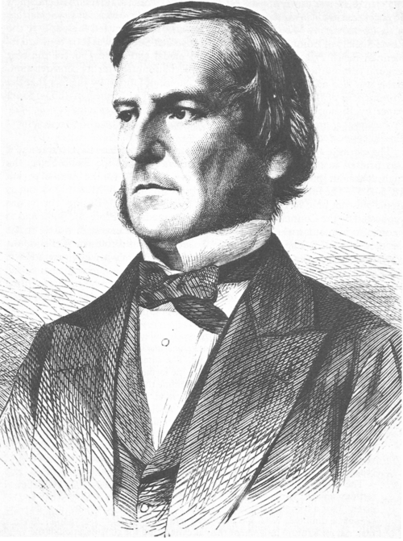

# Les Conditions

## Un peu d'histoire

### George BOOLE (1815-1864)

<div style="border: 1px solid #ccc; padding: 10px; text-align: center; border-radius: 8px;">
  
  <span style="font-style: italic; color: gray;">Carte de la France avec ses régions (2025)</span>
</div>

Mathématicien anglais, il publie en 1854 les "Lois de la pensée". Dans ce livre, il décrit comment toute la logique peut être définie par un principe simple : le binaire.

## Les opérateurs booléens

### Applications

**Application I**

<u>Sur l'ordinateur :</u> Tester les trois opérateurs avec des valeurs différentes et compléter leurs tables de vérité.

Exemple de code pour tester les opérateurs :

```python
r = not False
```

|A	|not A|
|False|	 |
|True|	| 


|A	|B	|A or B|
|False|	False|	 |
|False|	True|	 |
|True|	False|	| 
|True|	True|	 |


|A	|B	|A and B|
|False|	False|	 |
|False|	True|	 |
|True|	False|	 |
|True|	True|	 |


**Application II**

<u>Sur feuille</u>, puis vérifier sur l'ordinateur

Donner la valeur (True ou False) des expressions suivantes :

```python
15 <= 20 or 1> 150
2 < 4 and 2 < 3
"A" == "A" and "B"=="B"
not (1 < 3)
not (15 <= 20) or 1 < 150
3 < 5 and ((7 < 5) or (2 < 3))
```

## Structures conditionnelles
Dans les codes ci-dessous, les conditions correspondent à une instruction qui renvoie un booléen.

### Structure du "if" seul

```python
# Instructions qui précèdent
if condition :
    # Bloc d'instructions exécuté si la condition renvoie True
# Instructions qui suivent
```

### Structure du "if else"

```python
# Instructions qui précèdent
if condition :
    # Bloc d'instructions exécuté si la condition renvoie True
else :
    # Bloc d'instructions exécuté si la condition renvoie False
# Instructions qui suivent
```

### Structure du "if elif else"

```python
# Instructions qui précèdent
if condition n°1 :
    # Bloc d'instructions exécuté si la condition n°1 renvoie True
elif condition n°2 :
    # Bloc d'instructions exécuté si la condition n°2 True (mais pas la n°1)
else :
    # Bloc d'instructions exécuté si les conditions n°1 et n°2 renvoient False
# Instructions qui suivent
```