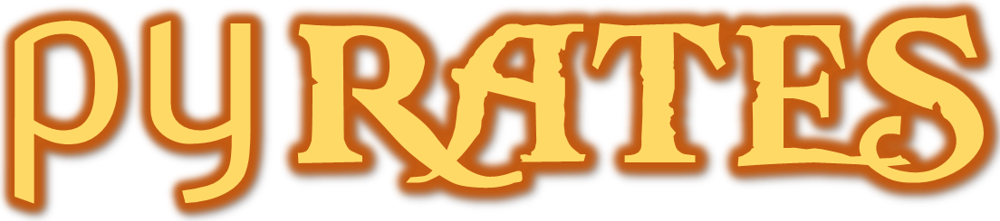

# Tp Py-Rates

<link rel="stylesheet" href="../assets/style.css" />

## Le jeu Py-Rates

Pour continuer la découverte du langage de programmation Python, vous allez utiliser l'ensemble de vos connaissance en programmation pour contrôler le personnage d'un jeu.

  

### L'application

Pour accèder à l'interface de l'application, rendez-vous sur le site de [Py-Rates](https://py-rates.fr/).

### Quelques consignes
- Bien lire de guide de démarrage pour prendre en main l'interface.
- Garder bien votre identifiant afin de pouvoir vous reconnecter et garder votre progression (en cas de fermeture de page).