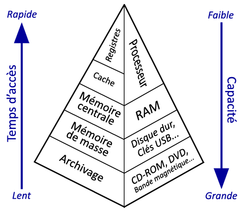

# Composants d'une machine

## La carte mère d'un ordinateur

La carte mère est l'ossature sur laquelle les différents composants d'un système informatique sont connectés.

### Le processeur

De façon imagée, le processeur est le cerveau de la carte-mère.

Un processeur est un circuit électronique composé de transistors. Le transistor est le composant de base. Assemblés, les transistors constituent des circuits logiques qui permettent d'accomplir des instructions.

Le processeur fonctionne au rythme de son horloge interne. A chaque top d'horloge, le processeur exécute une action correspondant à une partie d'instruction.

Une instruction est une opération élémentaire que le processeur réalise grâce à ses circuits logiques. L'ensemble des opérations élémentaires d'un processeur constitue son jeu d'instruction.

Lorsque le processeur exécute une instruction, les données sont temporairement stockées dans de petites mémoires rapides que l'on appelle registres.

### Le chipset

Le chipset est un circuit électronique qui contrôle et régule les échanges de données entre les divers composants de la carte-mère.
De façon imagée, le chipset est la tour de controle de la carte-mère.
Sur les cartes mères actuelles, le chipset est composé de deux parties :

- le northbridge (pont nord) : il fait la connection entre le processeur et les éléments qui nécessitent une liaison rapide (ram, carte graphique...)
- le southbridge (pont sud) : il fait la connection avec les périphériques plus lents (disque dur, carte réseau, carte son, ports USB…)

### Le générateur de fréquence (horloge)

Le générateur de fréquence est un circuit électronique qui génère un signal périodique. Ce signal sert à cadencer et synchroniser le travail du processeur et du chipset.

### Les bus

Les bus sont les connections filaires entre les différents composants de la carte. Ils permettent les échanges d'information.

Un bus se décompose en trois parties :

- le bus de données : transmet les données ;
- le bus d'adresses : transmet l'adresse de la source ou de la destination des données ;
- le bus de commandes ou de contrôle : contrôle l'accès et l'utilisation des deux autres bus.

### Les mémoires

La mémoire permet de stocker des données et des programmes.

#### Caractéristiques d'une mémoire :

- Capacité : volume d'informations (en bits ou en octets) que la mémoire peut stocker.
- Temps d'accès : temps entre la demande de lecture/écriture et la disponibilité de la donnée.
- Débit : volume d'information échangé par unité de temps (en bits par seconde).
- Volatilité  : aptitude de la mémoire à conserver ou non les données lorsqu'elle n'est plus alimentée.

Les différents types de mémoire d'une machine informatique sont :

- Les registres du processeur. Cette mémoire sert au fonctionnement du processeur. C'est une mémoire de très petite capacité, extrêment rapide et volatile.

- La mémoire cache du processeur. Cette mémoire aide le processeur à fonctionner. Elle lui permet de stocker temporairement des données et des instructions. Elle permet de limiter les accès à la mémoire RAM, trop lents pour le processeur. C'est une mémoire de petite capacité, rapide et volatile.

- La mémoire morte (ROM). Cette mémoire n'est accessible qu'en lecture. Elle sert en général à stocker les informations de démarrage d'une machine informatique.

- La mémoire RAM. Cette mémoire sert à stocker les données et les programmes lors du fonctionnement de l'ordinateur. C'est une mémoire moyennement rapide et volatile.

- La mémoire de masse. Cette mémoire sert à conserver les données et les programmes. C'est une mémoire de grande capacité, plutôt lente et non volatile.

#### Comparaison des mémoires

  

### Les ports (connecteurs)
- Les connecteurs internes
- Les connecteurs externes

