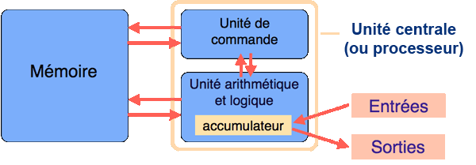
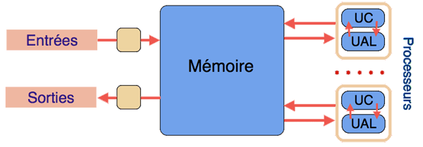
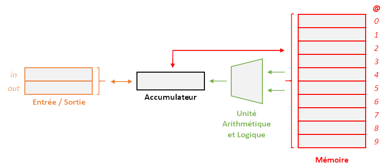
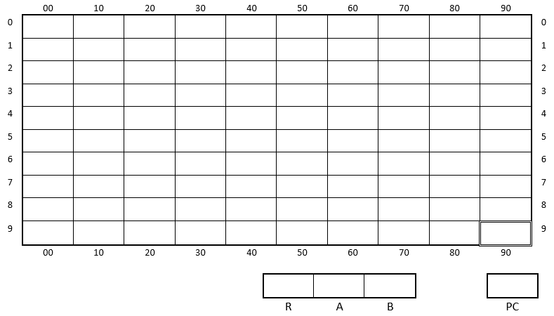
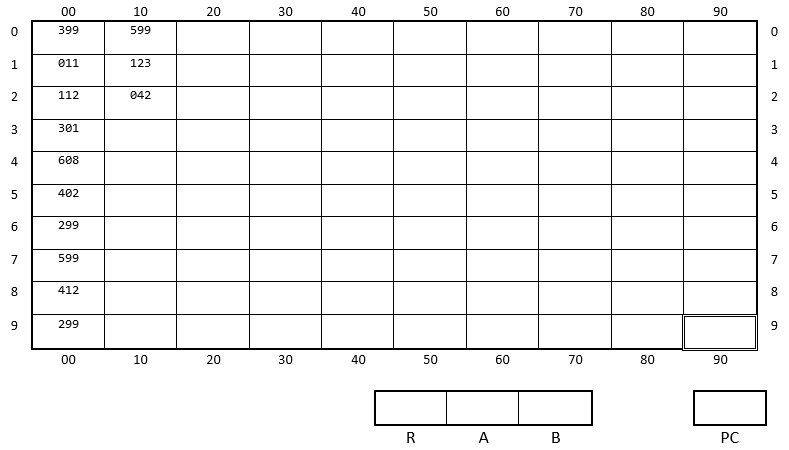

<link rel="stylesheet" href="../../assets/style.css" />
<script src="https://cdn.jsdelivr.net/npm/mathjax@3/es5/tex-mml-chtml.js"></script>


# Modèle d’architecture séquentielle (Von Neumann) 

## Un peu d'histoire...

Le modèle d'architecture "von Neumann" d'une machine informatique a été élaboré en 1945 par **John Von Neumann** dans le cadre des recherches sur les premiers ordinateurs.  

L'une des spécificités de ce modèle est que la mémoire peut **contenir indifféremment des instructions et des données**. En conséquence, **un programme peut être traité comme une donnée par d’autres programmes**.


Pour aller plus loin : <a href="https://interstices.info/le-modele-darchitecture-de-von-neumann/" target="_blank">Le modèle d’architecture de von Neumann (sur interstices.info)</a>

## Description du modèle

<div style="display: flex; flex-direction:column;  border: 1px solid #ccc; text-align: center; border-radius: 8px;">
  
  <span style="font-style: italic; color: gray;">Modèle von Neumann (source : interstices.info)</span>
</div>
<br>

### Unité de commande ou unité de contrôle (CU en anglais)

Ce composant commande et contrôle le fonctionnement du système. C'est lui qui gère l'aspect séquentiel du fonctionnement. En particulier, il récupère en mémoire la prochaine instruction à exécuter et les données à utiliser et les envoie à l'unité arithmétique et logique.

### Unité arithmétique et logique (ALU en anglais)

Composant qui exécute les opérations sur les données :

- opérations arithmétiques (addition, multiplication...) ;
- opérations logiques (and, or, not...).

### Mémoire

La mémoire contient à la fois les données et les programmes.

### Entrées / Sorties

- Entrées : clavier, souris, etc.
- Sorties : imprimantes, écran, etc.
- Mixte : carte réseau, lecteur de disques, clé USB, etc.

## Évolution du modèle

Aujourd'hui, on peut noter deux évolutions par rapport au modèle d'origine :

- Les entrées/sorties ne sont plus gérées par l'unité de commande, mais par des processeurs autonomes.
- Les ordinateurs sont constitués de plusieurs processeurs, on parle d'architecture multiprocesseur (ou multicœurs).

Le schéma précédent devient :

<div style="display: flex; flex-direction:column;  border: 1px solid #ccc; text-align: center; border-radius: 8px;">
  
  <span style="font-style: italic; color: gray;">Modèle von Neumann actuel (source : interstices.info)</span>
</div>
<br>

### D'autres modèles

Il existe d'autres modèles d'architecture de machines informatiques. On peu citer l'architecture Harvard dans laquelle il existe deux mémoires : l'une pour les données, l'autre pour les instructions.

## Que contient un ordinateur ?

> 🧠 Brainstorming : Quelles sont les composants que vous connaissez ?

> 💻 A faire ensuite : Faire la liste des éléments que contient un ordinateur ainsi que leur fonction.

## Un modèle simplifié : la machine M-10-io

Afin de comprendre de fonctionnement d'un ordinateur, nous allons commencer avec un modèle d'ordinateur minimaliste : **la machine M-10-io.**


<div style="display: flex; flex-direction:column;  border: 1px solid #ccc; text-align: center; border-radius: 8px;">
  
  <span style="font-style: italic; color: gray;">Schéma de principe</span>
</div>
<br>

### Instructions disponibles

<strong><span style="color: rgb(74, 183, 81);">Instructions arithmétiques</span></strong>

Ces instructions nécessitent deux opérandes prises en mémoire. Le résultat est placé dans l'accumulateur.

- **ADD** : additionne les deux opérandes
- **SUB** : soustrait le deuxième opérande du premier
- **MUL** : multiplie les deux opérandes
- **DIV** : divise le premier opérande par le deuxième

Exemple :

```
ADD @1 @2 : additionne les contenues des mémoires 1 et 2 et stocke le résultat dans l'accumulateur.
```

<strong><span style="color: rgb(74, 183, 81);">Instructions logiques</span></strong>

Ces instructions nécessitent deux opérandes prises en mémoire.

- **EQU** : teste l'égalité des deux opérandes
- **NEQ** : teste la non égalité des deux opérandes
- **LSS** : teste si le premier opérande est plus petit (strictement) que le deuxième
- **LEQ** : teste si le premier opérande est plus petit ou égale au deuxième
- **GTR** : teste si le premier opérande est plus grand (strictement) que le deuxième
- **GEQ** : teste si le premier opérande est plus grand ou égale au deuxième

Exemple :

```
EQU @1 @2 : teste si le contenu de la mémoire 1 est égale au contenu de la mémoire 2 et stocke le résultat dans l'accumulateur sous la forme d'un 0 ou d'un 1.
```

<strong><span style="color: rgb(240, 47, 29);">Instructions de transfert mémoire</span></strong>

Ces instructions nécessite un seul opérande.

- **LOAD @_** : transfert la mémoire vers l'accumulateur
- **STORE @_** : transfert de l'accumulateur vers la mémoire

<strong><span style="color: rgb(251, 135, 20);">Instructions d'entrée/sortie</span></strong>

Ces instruction permettent d'interagir avec l'utilisateur

- **READ** : lit une valeur au clavier et la stock dans l'accumulateur
- **PRINT** : écrit la valeur de l'accumulateur sur l'écran


> 🖋️ A faire : Écrire un programme qui :
>
> - récupère un nombre entré par l'utilisateur ;
> - soustrait 2 à ce nombre ;
> - multiplie le résultat par 4 ;
> - affiche le résultat à l'écran.

## Un autre modèle un peu moins simplifié : la machine M999

Le modèle précédent ne permet pas de savoir où est stocké le programme, il est par ailleurs assez limité !

Voici un autre modèle, le M999, qui rend davantage compte de ce qui se passe dans un ordinateur.

### Principe

Le M999 est constitué des éléments suivants :

- une **mémoire** qui contient à la fois les données et le programme ;
- une **unité arithmétique et logique** (UAL ou ALU en anglais) en charge de réaliser les opérations comme l'addition, la comparaison, etc ;
- une **unité de commande** (ou unité de contrôle UC) qui pilote l'ordinateur ;
- des **dispositifs d’entrée-sortie**.

### Mémoires et registres

La mémoire est composée de 100 "emplacements" que l'on appelle **mots mémoire**, pouvant chacun **stocker 3 chiffres** (*ainsi, les mots mémoire peuvent prendre les valeurs de 000 à 999*). Chaque mot mémoire est repéré par son **adresse mémoire**, codée sur 2 chiffres (de 00 à 99).

Cette mémoire va contenir **les données et les instructions**.

Le M999 dispose de **deux registres généraux** notés A et B, et d'**un registre accumulateur/résultat** noté R. Ces registres peuvent chacun stocker un mot mémoire.

Le M999 dispose aussi d'**un registre pointeur d'instruction PC** contenant l'adresse mémoire de la prochaine instruction à exécuter.

<div style="display: flex; flex-direction:column;  text-align: center; ">
  
</div>

### Unité arithmétique et logique

L'unité arithmétique et logique est en charge d'effectuer les calculs. Les opérandes des instructions sont dans les registres A et B. Le résultat est dans le registre R.

### Unité de commande

L'unité de commande pilote l'ordinateur.

Son cycle de fonctionnement comporte 3 étapes :

- elle charge l'instruction depuis la mémoire pointée par PC et incrémente PC ;
- elle décode l'instruction ;
- elle exécute l'instruction.

### Jeu d'instructions

| c0 | c1c2 | Mnémonique | Instruction à réaliser |
|:---:|:------:|:---:|:---:|
| 0 | addr | LDA | Copie le mot mémoire d’adresse `addr` dans le registre A |
| 1 | addr | LDB | Copie le mot mémoire d’adresse `addr` dans le registre B |
| 2 | addr | STR | Copie le contenu du registre R dans le mot mémoire d’adresse `addr` |
| 3 | -- | – | Opérations arithmétiques et logiques |
| 3 | 00 | ADD | Ajoute les valeurs des registres A et B, produit le résultat dans R |
| 3 | 01 | SUB | Soustrait la valeur du registre B à celle du registre A (c’est-à-dire A - B), produit le résultat dans R |
| 3 | .. | etc | ... |
| 3 | 99 | NOP | Ne fait rien |
| 4 | rs rd | MOV | Copie la valeur du registre source `rs` dans le registre destination `rd` |
| 5 | addr | JMP | Affecte la valeur `addr` au registre PC |
| 6 | addr | JPP | Affecte la valeur `addr` au registre PC si la valeur du registre R est strictement positive et ne fait rien sinon |

Les registres sont désignés par les valeurs suivantes :

| valeur | registre |
|:---:|:---:|
| 0 | A |
| 1 | B |
| 2 | R |

### Démarrage (boot) et arrêt du programme

La machine démarre avec la valeur nulle comme pointeur d'instruction PC.

La machine stoppe si le pointeur d'instruction vaut 99. Ainsi, la dernière instruction d'un programme est JMP 99 (soit le code 599).

### Entrées/sorties

L'emplacement mémoire d'adresse 99 sert d'entrée et de sortie.

## Analyse de quelques programmes

> ### Application 1
>
> Soit l'état suivant de la mémoire :
>

<div style="display: flex; flex-direction:column;  text-align: center; ">
  
</div>

>
> 1) Expliquer pas à pas l'exécution du programme.
> 
> 2) Que se passe-t-il si on inverse les contenus de @11 et @12.
> 
> 3) Expliquer en une phrase le rôle de ce programme.
>
> ### Application 2
>
> 1) En utilisant les mnémoniques, écrire un programme qui affiche successivement les nombres de 1 à 10.
>
> 2) Coder ce programme sur le M999.

## Pour aller plus loin

Vidéo de Underscore_ "On a reçu l'étudiant qui a frabriqué son processeur" : 
https://www.youtube.com/watch?v=KsR7sZztx4U