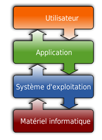

# Système d'exploitation ( OS = Operating system )

## Qu'est ce qu'un système d'exploitation ?

Un **système d’exploitation** est un logiciel essentiel qui sert **d’intermédiaire entre l’utilisateur, les programmes, et le matériel de l’ordinateur**.

<div style="display: flex; flex-direction:column;  text-align: center; ">
  
</div>


### Activité : Vidéo Introduction 🖋️

<video width="640" height="360" controls>
    <source src="https://www.youtube.com/watch?v=Y-KyODibJcw" type="video/mp4">
    Votre navigateur ne supporte pas la vidéo HTML.
</video>

<iframe width="640" height="360"
src="https://www.youtube.com/embed/watch?v=Y-KyODibJcw"
title="YouTube video player"
frameborder="0"
allowfullscreen>
</iframe>

1) Quel est le rôle principal d’un système d’exploitation ?


<details>
  <summary style="cursor: pointer; font-weight: bold;"><u>Réponse</u></summary>
  <div style="margin-top: 10px;">
    <p>Son rôle est d'exploiter des ressources matérielles.</p>
  </div>
</details>


2) Donnez les 5 systèmes d’exploitation les plus importants.


<details>
  <summary style="cursor: pointer; font-weight: bold;"><u>Réponse</u></summary>
  <div style="margin-top: 10px;">
    <ul>
      <li>Windows</li>
      <li>Mac OS</li>
      <li>Linux</li>
      <li>iOS</li>
      <li>Androïd</li>
    </ul>
  </div>
</details>

3) Quelles sont les six grandes fonctions d’un système d’exploitation ?


<details>
  <summary style="cursor: pointer; font-weight: bold;"><u>Réponse</u></summary>
  <div style="margin-top: 10px;">
    <ul>
      <li>gestion des processus </li>
      <li>gestion de la mémoire</li>
      <li>gestion des fichiers</li>
      <li>gestion des entrées / sorties</li>
      <li>gestion des communications réseau</li>
      <li>interfaces graphiques / interactions</li>
    </ul>
  </div>
</details>


### Activité : Systèmes d'exploitations libres et propriétaires 💻

À l’aide de recherches sur le Web, répondez de manière synthétique aux questions suivantes. Utilisez vos
propres mots. Ne copiez-collez pas les réponses.

4) Quelles sont les principales différences entre un système d'exploitation libre et un système
d'exploitation propriétaire ? 


<details>
  <summary style="cursor: pointer; font-weight: bold;"><u>Réponse</u></summary>
  <div style="margin-top: 10px;">
    <table>
      <thead>
        <tr>
          <th>Critère</th>
          <th>Windows</th>
          <th>Linux</th>
        </tr>
      </thead>
      <tbody>
        <tr>
          <td>Coût</td>
          <td>Payant (licence requise)</td>
          <td>Gratuit (open source)</td>
        </tr>
        <tr>
          <td>Sécurité</td>
          <td>Plus vulnérable aux virus et malwares</td>
          <td>Plus sécurisé grâce à sa conception et sa communauté active</td>
        </tr>
        <tr>
          <td>Personnalisation</td>
          <td>Limité (thèmes et quelques réglages)</td>
          <td>Très élevé (choix d’environnements de bureau, customisation complète)</td>
        </tr>
        <tr>
          <td>Performances</td>
          <td>Peut être gourmand en ressources</td>
          <td>Léger et optimisé, surtout avec des distributions minimalistes</td>
        </tr>
        <tr>
          <td>Compatibilité logicielle</td>
          <td>Compatible avec la plupart des logiciels grand public (jeux, logiciels Adobe, etc.)</td>
          <td>Certains logiciels ne sont pas disponibles nativement (mais alternatives ou Wine possibles)</td>
        </tr>
        <tr>
          <td>Mises à jour</td>
          <td>Automatiques mais parfois imposées</td>
          <td>Gérées par l’utilisateur et souvent plus fréquentes</td>
        </tr>
        <tr>
          <td>Gaming</td>
          <td>Support officiel des jeux via DirectX</td>
          <td>Support limité mais en amélioration (Proton, Steam Deck)</td>
        </tr>
        <tr>
          <td>Support matériel</td>
          <td>Excellente compatibilité avec les périphériques récents</td>
          <td>Parfois des problèmes avec des pilotes propriétaires</td>
        </tr>
      </tbody>
    </table>
  </div>
</details>


5) Quels sont les avantages des systèmes d'exploitation libres ? Et ceux des
système d'exploitation propriétaires ? 

<details>
  <summary style="cursor: pointer; font-weight: bold;"><u>Réponse</u></summary>
  <div style="margin-top: 10px;">
    <p>Avatanges de Linux : Linux est en général gratuit, il n'y a pas de licence à payer. Il n'y a quasiment pas de virus sur Linux. Le code étant ouvert, il est plus raisonnable d'avoir confiance dans Linux.</p>
    <p>Avantage de Windows : Windows est le système d'exploitation le plus répandu, la plupart des logiciels existent donc pour ce système d'exploitation. Il permet de jouer à tous les jeux. Il existe également un large choix d'ordinateurs fonctionnant sous Windows.</p>
  </div>
</details>

6) Cherchez les noms d’une dizaine de distributions Linux.


<details>
  <summary style="cursor: pointer; font-weight: bold;"><u>Réponse</u></summary>
  <div style="margin-top: 10px;">
    <p>Ubuntu, Red Hat, Linux Mint, Arch Linux, Debian, CentOS, Gentoo, OpenSUSE Linux, Slackware, Fedora…</p>
  </div>
</details>


7) Peut-on dire qu’Android est un SE libre ? Pourquoi la réponse est-elle nuancée ? 


<details>
  <summary style="cursor: pointer; font-weight: bold;"><u>Réponse</u></summary>
  <div style="margin-top: 10px;">
    <p>Android est basé sur un projet open source, ce qui signifie que son code source est accessible et peut être modifié ou redistribué, et il repose aussi sur le noyau Linux, qui est lui-même un logiciel libre.</p>
    <p>Mais... beaucoup de composants ne sont pas libres. La plupart des smartphones Android incluent des composants propriétaires ajoutés par les fabricants ou par Google, par exemple :</p>
    <ul>
      <li>Google Play Services</li>
      <li>Google Play Store</li>
    </ul>
  </div>
</details>


## Le système de fichiers

C'est la méthode d'organisation des données sur le disque dur.  
La structure est **arborescente** (comme un arbre inversé), partant d'une **racine**.

- **Sous UNIX / Linux** : La racine est notée `/`. Tout est fichier ou dossier à partir de cette racine.
  - `/home` : Dossiers des utilisateurs.
  - `/etc` : Fichiers de configuration.
  - `/bin` : Programmes exécutables.

- **Sous Windows** : La racine est souvent `C:\`. Chaque lecteur a sa propre lettre.
  - `C:\Users` : Dossiers des utilisateurs.
  - `C:\Windows` : Système.
  - `C:\Program Files` : Logiciels installés.

## Les commandes Linux 

Le programme utilisé pour donner des ordres *(les commandes)* à l’ordinateur s’appelle **la console** (ou *shell* en anglais).

Celle-ci permet à la fois d’écrire les commandes et d'en visualiser le résultat lorsqu'il y en a un.

Une fois écrite, la commande doit être validée en appuyant sur la touche **ENTREE**.

Sous Linux, le shell vous indique qu’il est prêt en affichant une invite (ou prompt). Cette invite est composée :

- du **nom de l'utilisateur**
- suivi du **caractère @**,
- suivi du **nom de la machine**,
- suivi du **caractère :**,
- suivi du **chemin absolu vers l'emplacement actuel**,
- suivi du **caractère $**.

```shell
user@machine:~$
```

Grâce au jeu Terminus, nous avons vu ces commandes :

### De navigation dans les répertoires

<div style="flex:1; min-width:500px;">
    <table style="border-collapse:collapse; width:100%; max-width:800px;">
      <thead>
        <tr>
          <th style="border:1px solid #444; padding:6px 10px; text-align:center;">Commande</th>
          <th style="border:1px solid #444; padding:6px 10px; text-align:center;">Signification</th>
          <th style="border:1px solid #444; padding:6px 10px; text-align:center;">Description</th>
          <th style="border:1px solid #444; padding:6px 10px; text-align:center;">Exemple</th>
        </tr>
      </thead>
      <tbody>
        <tr>
          <td style="border:1px solid #444; padding:6px 10px;">ls</td>
          <td style="border:1px solid #444; padding:6px 10px; text-align:center;">List </td>
          <td style="border:1px solid #444; padding:6px 10px; text-align:center;">Liste les fichiers et dossiers du répertoire </td>
          <td style="border:1px solid #444; padding:6px 10px;"><code>ls -l</code> </td>
        </tr>
        <tr>
          <td style="border:1px solid #444; padding:6px 10px;">cd </td>
          <td style="border:1px solid #444; padding:6px 10px; text-align:center;">Change Directory </td>
          <td style="border:1px solid #444; padding:6px 10px; text-align:center;">Change de répertoire courant </td>
          <td style="border:1px solid #444; padding:6px 10px;"><code>cd Documents</code>, <code>cd ..</code>(remonter), <code>cd ~</code> (racine) </td>
        </tr>
        <tr>
          <td style="border:1px solid #444; padding:6px 10px;">pwd </td>
          <td style="border:1px solid #444; padding:6px 10px; text-align:center;"> Print Working Directory</td>
          <td style="border:1px solid #444; padding:6px 10px; text-align:center;"> Affiche le chemin absolu du dossier actuel</td>
          <td style="border:1px solid #444; padding:6px 10px;"><code>pwd</code> -> /home/eleve  </td>
        </tr>
      </tbody>
    </table>
</div>

### Manipulation des fichiers

<div style="flex:1; min-width:500px;">
    <table style="border-collapse:collapse; width:100%; max-width:800px;">
      <thead>
        <tr>
          <th style="border:1px solid #444; padding:6px 10px; text-align:center;">Commande</th>
          <th style="border:1px solid #444; padding:6px 10px; text-align:center;">Description</th>
          <th style="border:1px solid #444; padding:6px 10px; text-align:center;">Exemple</th>
        </tr>
      </thead>
      <tbody>
        <tr>
          <td style="border:1px solid #444; padding:6px 10px;">cat</td>
          <td style="border:1px solid #444; padding:6px 10px; text-align:center;">Affiche le contenu d'un fichier dans le terminal </td>
          <td style="border:1px solid #444; padding:6px 10px;"> <code>cat README.md</code>  </td> 
        </tr>
        <tr>
          <td style="border:1px solid #444; padding:6px 10px;">rm </td>
          <td style="border:1px solid #444; padding:6px 10px; text-align:center;">Supprime définitivement des fichiers </td>
          <td style="border:1px solid #444; padding:6px 10px;"><code>rm fichier.txt</code>, <code>rm -r dossier/</code>(supprimer dossier et contenu) </td>
        </tr>
        <tr>
          <td style="border:1px solid #444; padding:6px 10px;">cp </td>
          <td style="border:1px solid #444; padding:6px 10px; text-align:center;">Copie un fichier ou un dossier </td>
          <td style="border:1px solid #444; padding:6px 10px;"><code>cp source.txt dest.txt</code> </td>
        </tr>
        <tr>
          <td style="border:1px solid #444; padding:6px 10px;">mv </td>
          <td style="border:1px solid #444; padding:6px 10px; text-align:center;">Déplace ou renomme un fichier</td>
          <td style="border:1px solid #444; padding:6px 10px;"><code>mv ancien.txt nouveau.txt</code>(renommer), <code>mv fichier.txt dossier/</code> (déplacer)</td>
        </tr>
        <tr>
          <td style="border:1px solid #444; padding:6px 10px;">touch </td>
          <td style="border:1px solid #444; padding:6px 10px; text-align:center;"> Crée un fichier vide</td>
          <td style="border:1px solid #444; padding:6px 10px;"><code>touch script.py</code> </td>
        </tr>
        <tr>
          <td style="border:1px solid #444; padding:6px 10px;">mkdir </td>
          <td style="border:1px solid #444; padding:6px 10px; text-align:center;">Crée un nouveau dossier (Make Directory) </td>
          <td style="border:1px solid #444; padding:6px 10px;"><code>mkdir NSI</code> </td>
        </tr>
      </tbody>
    </table>
</div>

Si vous ne vous souvenez plus du fonctionnement de ces commandes, vous pouvez toujours utiliser `man` ou `help` suivi de la commande pour vous les remémorer.

### Activité : Machine virtuelle 💻

**L'objectif de l'activité est de manipuler les commandes de base que l'on peut utiliser dans le shell, vu précédemment.**

Nous travaillerons dans un simulateur Linux en ligne.

#### Préparation du travail

1. Se créer un compte  

- Ouvrir la page https://vfsync.org/signup

- Compléter le formulaire (bien se souvenir de son nom d'utilisateur et de son mot de passe).

2. Se connecter

- Ouvrir la page https://vfsync.org/vm.html?login=1

- Completer le formulaire avec son nom d'utilisateur et son mot de passe.

3. Charger l'arborescence qui servira de base de travail

**Cette étape n'a besoin d'être faite qu'une seule fois.**

- Télécharger le fichier suivant sur votre ordinateur : [Animal.zip](Animal.zip)

- Dans l'environnement `vfsync`, charger le fichier Animal.zip an cliquer sur l'icone Chargement d'un fichier. (voir dessin au tableau)

- Taper et valider successivement les commandes suivantes :

```shell
sudo unzip Animal.zip
```

```shell
sudo chown -R [votre nom d'utilisateur]:root Animal
```

```shell
chmod u=rwx -R Animal
```

#### Travail à faire : Grand rangement !

1. En vous plaçant dans le dossier Animal, exécuter la commande `tree`. Voici le résultat que vous devez obtenir.

```
Animal
├── Invertebre
│   ├── Insecte
│   └── Plante
├── Vertebre
│   ├── Mammifere
│   │   ├── singe.jpg
│   │   └── singe.txt
│   ├── Poisson
│   │   ├── Cetace
│   │   └── Plante
│   └── Reptile
├── aigle.jpg
├── aigle.txt
├── baleine.jpg
├── baleine.txt
├── crocodile.jpg
├── crocodile.txt
├── grenouille.jpg
├── grenouille.txt
├── huitre.jpg
├── huitre.txt
├── puceron.jpg
├── puceron.txt
├── tortue.jpg
└── tortue.txt
```

En utilisant les commandes étudiées, modifier l'arborescence précédente pour la transformer en l'arborescence suivante :

```
Animal
├───Invertebre
│   ├────Insecte
│   │   ├───mouche.jpg
│   │   ├───mouche.txt
│   │   ├───puceron.jpg
│   │   └───puceron.txt
│   │───Mollusque
│   │   ├───huitre.jpg
│   │   └───huitre.txt
│───Vertebre
│   │───Amphibien
│   │   ├───grenouille.jpg
│   │   └───grenouille.txt
│   │───Mammifere
│   │   ├───singe.jpg
│   │   └───singe.txt
│   ├───Oiseau
│   │   ├───aigle.jpg
│   │   └───aigle.txt
│   │───Poisson
│   │   ├───Cetace
│   │   │   ├───baleine.jpg
│   │   │   └───baleine.txt
│   │───Reptile
│   │   ├───crocodile.jpg
│   │   ├───crocodile.txt
│   │   ├───tortue.jpg
│   │   └───tortue.txt
```

## Les permissions

Après avoir vu les commandes de base nous allons voir la **gestion des droits sous Linux**. C’est à dire ce qu’un utilisateur est autorisé à effectuer sur un fichier ou un répertoire.

### Généralités

Avec les systèmes d'exploitation basés sur un noyau Linux, les fichiers et dossiers ont des **droits d'accès** :

- l'accès en **lecture** ➙ lettre **r** (pour *Read*)
- l'accès en **écriture** ➙ lettre **w** (pour *Write*)
- l'accès en **exécution** ➙ lettre **x** (pour *eXecute*)

Les droits sont accordés à **trois catégories d'utilisateurs** :

- le **propriétaire** ➙ lettre **u** (pour *User*)
- le **groupe d'utilisateur** ➙ lettre **g** (pour *Group*)
- **tous utilisateurs autres** que le propriétaire et ceux du groupe ➙ lettre **o** (pour *Other*)
- **tous les utilisateurs** ➙ lettre **a** (pour *All*)

### La commande chmod

La commande `chmod` permet de modifier les droits d'accès à un fichier ou un répertoire.

#### Syntaxe en mode symbolique

```shell
chmod [ugoal][+-=][rwx] <fichier/répertoire>
```

- [ugoal] est la lettre correspondant au destinataire du droit d'accès : u, g, o ou a
- [+-=] est le symbole qui définit la façon de gérer la modification des droits : + pour ajouter ajouter, - pour enlever et = redéfinir le droit d'accès
- [rwx] est un ensemble de 3 lettres au maximum pour spécifier les droits que l'on attribue
- <fichier/répertoire> est le chemin vers le fichier ou le dossier


**Exemples:**

• `chmod a-wx chat.txt` : permet de retirer à tous les utilisateurs la possibilité de modifier et d'exécuter le fichier chat.txt
• `chmod o+rw chien.txt` : permet d'ajouter aux utilisateurs autres que le propriétaire et ceux du groupe, la possibilité de lire et de modifier le fichier chien.txt
• `chmod u=r souris.txt` : permet de faire en sorte que le propriétaire n'est autorisé qu'à lire le fichier souris.txt

### Application 💻

#### Droits de lecture

- Supprimer les droits de lecture (mais pas ceux d'écriture et d'exécution) à l'utilisateur pour le dossier Animal.

- Essayer d'entrer dans le dossier Animal puis d'afficher le contenu du dossier Animal.

#### Droits d'exécution

- Supprimer les droits d'execution (mais pas ceux de lecture et d'écriture) à l'utilisateur pour le dossier Animal.

- Essayer d'entrer dans le dossier Animal.

#### Droits d'écriture (modification)

- Supprimer les droits d'écriture (mais pas ceux de lecture et d'exécution) à l'utilisateur pour le dossier Animal.

- Essayer d'entrer dans le dossier Animal, puis d'y créer un nouveau dossier appelé Autre