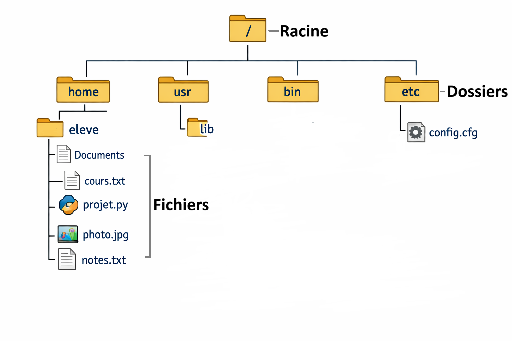

# Tp : Terminus

## Quelques bases : Arborescence de fichier 

Une arborescence de fichiers est une organisation hiérarchique des dossiers (répertoires) et des fichiers d’un système informatique.

On parle d’arborescence car la structure ressemble à un arbre :

- Une **racine** (le point de départ)

- Des **branches** (les dossiers)

- Des **feuilles** (les fichiers)

Chaque dossier peut contenir :

- des fichiers (possèdant chacun un **chemin unique** pour le retrouver)

- d’autres dossiers

- qui eux-mêmes peuvent contenir d’autres éléments

- et parfois même des raccourcis vers d'autres dossiers/fichiers

Cela permet d’organiser les données de manière **claire** et **structurée**.

**Exemple d'arborescence :**

  

> Sur l'image précédente :
>
> 1. Comment s'appelle le dossier racine ?
> 
> 2. Nommer TOUS les dossiers.
>
> 3. Comment accéder aux fichier `projet.py` ?

## Le jeu Terminus

Pour naviguer dans cette arborescence, pas de souris ni de représentation graphique, il faut tout faire en ligne de commande ! Nous allons justement les apprendre de manière ludique sur le jeu Terminus.

Le jeu initial se trouve sur <a href="https://www.mprat.org/Terminus/">cette adresse</a>, mais dans une optique de continuer le jeu plus tard si vous le souhaitez, et parce que celui-ci est entièrement en anglais, nous allons plutot utiliser <a href="https://luffah.xyz/bidules/Terminus/">ce lien </a>.

### Activité

> 1. Sur la feuille distribuée, remplissez les commandes que vous avez utilisées tout au long du jeu avec votre description de ce que font les commandes.
>
> 2. Au dos de la feuille, reproduire l'arborescence du jeu ( chaque lieu est un dossier, chaque habitant est un fichier)
>
> 3. Amusez-vous !