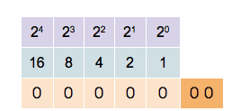
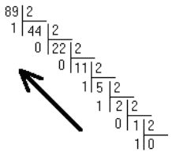

<link rel="stylesheet" href="../assets/style.css" />
<script src="https://cdn.jsdelivr.net/npm/mathjax@3/es5/tex-mml-chtml.js"></script>

# Représentation des entiers naturels

Vus de l’extérieur, les ordinateurs que nous utilisons tous les jours permettent de mémoriser, transmettre et transformer des nombres, des textes, des images, des sons, etc. Pour effectuer toutes ces manipulations, ceux-ci utilisent des courants électriques, des aimants, des rayons de lumière, ..., qui peuvent être représentés par deux états possibles :

- tension nulle ou tension non nulle (5V par exemple) pour les courants électriques,
- aimantation dans un sens ou dans l’autre sens pour les aimants,
- lumière ou pas de lumière pour les rayons, etc.
D’un point de vue pratique, les informaticiens ont décidé de représenter et traduire ces deux états à l’aide des deux chiffres 0 et 1.

<div style="text-align: center;">
  
</div>

## Comprendre le principe des différentes bases

### Compter dans les différentes bases

*A faire (sans ordinateur et sans calculatrice)*
  
Écrire les 32 premiers nombres dans les différentes bases en complétant le tableau ci-dessous.  
  
| Base 10 |	Base 2 | Base 3 | Base 5 | Base 8 |	Base 16 |
|:-------:|:------:|:------:|:------:|:------:|:-------:|
|         |        |        |        |        |         |
|         |        |        |        |        |         |

Remarques :

- la base 10 est également appelée "le décimal"
- la base 16 est également appelée "l'hexadécimal"

### Valeur en base 10 d'un nombre écrit en base n

**Exemples**

- Le nombre $$(4532)_{10}$$ a pour valeur en base 10 :  
  $$4 \times 10^{3} + 5 \times 10^{2} + 3 \times 10^{1} + 2 \times 10^{0}$$

- Le nombre $$(4301)_{5}$$ a pour valeur en base 10 :  
  $$4 \times 5^{3} + 3 \times 5^{2} + 0 \times 5^{1} + 1 \times 5^{0}$$

➜ Il en est de même pour toutes les bases.

### Généralisation

> La valeur en base 10 du nombre qui s’écrit $$a_n \dots a_3 a_2 a_1 a_0$$ en base $$x$$ répond à l’égalité suivante :  
>
> $$a_n \dots a_3 a_2 a_1 a_0 = a_n \times x^{n} + \dots + a_3 \times x^{3} + a_2 \times x^{2} + a_1 \times x^{1} + a_0 \times x^{0}$$
>
> Cette relation permet de calculer la valeur en base dix d’un nombre écrit dans n’importe quelle base.

**À faire (sans ordinateur et sans calculatrice)**

1. Convertir $$(323)_{4}$$ en base 10.  

2. Donner la valeur en base 10 de $$(110011)_{2}$$.  

3. Convertir $$(B9)_{16}$$ en base 10.

<div style="text-align: center;">
  
</div>

## Valeur en base $$x$$ d'un nombre écrit en base 10

# I.3 – Valeur en base $$x$$ d’un nombre écrit en base 10

**Exemple**

On souhaite écrire $$(89)_{10}$$ en base 2.

*(schéma des divisions successives à insérer ici sous forme d’image)*  

Donc $$(89)_{10} = (1011001)_{2}$$

---

### Généralisation

> L’écriture en base $$x$$ d’un nombre en base dix nécessite de faire des divisions successives par $$x$$ et de garder les restes.

---

**À faire (sans ordinateur et sans calculatrice)**  

1. Convertir $$(202)_{10}$$ en base 2.  

2. Écrire $$(101)_{10}$$ en base 3.


## Représentation des entiers naturels

Les entiers naturels sont représenté par leur valeur en base 2.

L'écriture en base 2 conduisant à beaucoup de 0 et de 1, il est courant de remplacer l'écriture en base 2 par l'écriture en base 16 (hexadécimal).

> ## Applications
>
> ### Application I
>
> **Passer de la base 10 à la base 2 et inversement**
>
> **À faire (sans ordinateur et sans calculatrice)**
>
> 1. À quel entier en base dix la séquence de bits `0100` correspond-elle ?
> 2. Quelle est la valeur décimale de l’entier qui s’écrit `1010` en binaire ?
> 3. Convertir en base 2 le nombre entier qui s’écrit `37` en base 10
> 4. Donner la séquence de 8 bits qui correspond au nombre `10` en base 10.
>
> ---
>
> ### Application II
>
> **Passer de la base 10 à la base 16 et inversement**
>
> **À faire (sans ordinateur et sans calculatrice)**
>
> 1. Quelle est l’écriture en base dix du nombre qui s’écrit `AAA` en base 16 ?
> 2. Convertir le nombre `6D` de la base 16 à la base 10.
> 3. Quelle est l’écriture en base 16 du nombre décimal `315` ?
> 4. Convertir le nombre `95` de la base 10 à la base 16.
>
> ---
>
> ### 🐍 Application III : Un peu de Python
>
> 1. Dans la documentation officielle de Python, rechercher les fonctions `bin(x)`, `oct(x)` et `hex(x)`.
>     - Expliquer leur rôle.
>     - Comment les nombres en base 2, 8 ou 16 sont-ils représentés dans le Shell ?
> 2. Utiliser ces trois fonctions pour faire quelques conversions.
> 3. Utiliser la fonction `print()` sur un nombre représenté en binaire. Quel est le résultat ?
>
> ---
>
> ### Application IV : Puissances de 2  
>
> *A faire (sans ordinateur et sans calculatrice)*
>
> Le roi Belkib (en Indes) promit une récompense fabuleuse à qui lui proposerait une distraction qui le satisferait.
> Lorsque le sage Sissa, fils du Brahmine Dahir, lui présenta le jeu d'échecs, le souverain satisfait, demanda à Sissa ce que > celui-ci souhaitait comme récompense de ce jeu extraordinaire.
> Sissa demanda au prince de déposer un grain de riz sur la première case, deux sur la deuxième, quatre sur la troisième, et ainsi de suite en doublant le nombre de grain à chaque case, et de lui donner l'ensemble du riz obtenu.
>Le prince accorda immédiatement cette récompense... Mais le royaume du roi Belkib sera-t-il en mesure de donner tout ce riz au sage Sissa ?
>
> 1) Écrire un programme qui affiche successivement (ligne par ligne) le nombre de grain de riz de chacune des 64 cases.
>
> Le résultat attendu dans la console est :
>
 ```shell
 Case 1 : 1
Case 2 : 2
Case 3 : 4
...
Case 64 :
```
>
> 2) Proposer une formule pour calculer directement le nombre de grain de riz qu'il y a sur la ième case.
>   
> 3) Compléter le programme précédent pour qu'il calcul le nombre total de grains de riz déposés sur l'ensemble des cases du plateau de jeu.
> 
> 4) En supposant que la masse de 1 grain est de 0,04 g, calculer la masse totale de riz.
> 
> ---
>
> ### Application V : Conversions
> 
> 1) Convertir le nombre binaire 1110 en base 8, 10 puis 16.
> 
> 2) Convertir le nombre binaire 11101011 en base 8, 10 puis 16.
> 
> 3) Convertir le nombre entier décimal 48 en base 2 et en base 16.
> 
> 4) Convertir le nombre décimal 124 en base 2 et en base 16.
> 
> ---
>
> ### Application VI : Un peu de python
> 
> 1) Écrire une fonction `dec_to_bin(nb:int)->str` qui prend un nombre entier positif en paramètre et renvoie une chaine de caractère correspondant à ce nombre en base 2.  
>   
> On utilisera pour cette fonction un algorithme basée sur les divisions successives par 2.  
>   
> Par exemple : `dec_to_bin(25)` doit renvoyer `"11001"`
> 
> 2) Écrire une fonction `bin_to_dec(c:str)->int` qui prend une chaine de caractère représentant un nombre binaire et renvoie la valeur décimale correspondante.
> 
> Exemple en ligne de commande :
> 
```shell
>>> bin_to_dec('1100')
12
```
> ---