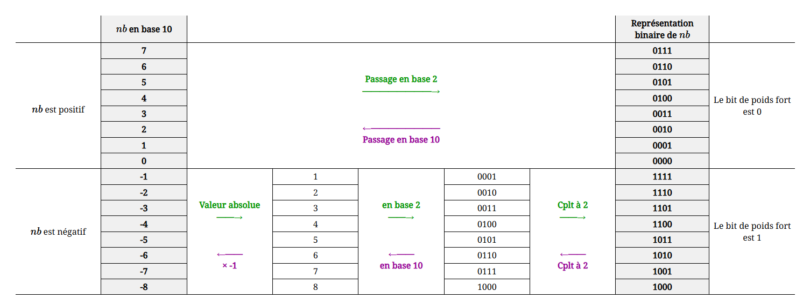

<link rel="stylesheet" href="../assets/style.css" />
<script src="https://cdn.jsdelivr.net/npm/mathjax@3/es5/tex-mml-chtml.js"></script>

# Représentation des entiers relatifs

## Méthode naïve: utilisation d’un bit de signe
 
La façon la plus simple de procéder serait de réserver le bit de poids fort pour le signe (0 pour positif et 1 pour négatif), et de garder le reste pour la représentation de la valeur absolue du nombre.

Avec un codage utilisant des mots de $$n$$ bits, on pourrait représenter des nombres entre 
$$-2^{n-1} + 1 \text{ et } 2^{n-1} - 1$$.

Par exemple, avec un codage sur 3 bits, des nombres entre -3 et 3:

| Représentation binaire | Valeur décimale |
|------------------------|-----------------|
| 000                    | +0              |
| 001                    | +1              |
| 010                    | +2              |
| 011                    | +3              |
| 100                    | -0              |
| 101                    | -1              |
| 110                    | -2              |
| 111                    | -3              |

<details>
  <summary style="cursor: pointer; font-weight: bold;">Mais alors ? Pourquoi pas cette méthode ? 🤔</summary>
  <div style="margin-top: 10px;">
    <p>
    Malheureusement cette représentation possède deux inconvénients. Le premier (mineur) est que le nombre zéro (0) possède deux représentations. L’autre inconvénient (majeur) est que cette représentation impose de modifier l’algorithme d’addition ; si un des nombres est négatif, l’addition binaire usuelle donne un résultat incorrect.
    </p>
  </div>
</details>

## Seconde méthode: Complément à 2

<span style="color: rgb(255,0,0);">La représentation d'un nombre entier relatif se fait avec un nombre de bits définit à l'avance.</span>

### Exemple avec 4 bits
Avec 4 bits, on dispose de $$2^4 = 16$$ valeurs.

On choisit de représenter les entiers relatifs de $$-8$$ à $$7$$.

<div style="display: flex; flex-direction:column; text-align: center;">
  
</div>

### Méthodologie

**Première Méthode :** ( à connaître )
> L'obtention du complément à 2 d'un nombre binaire se fait en deux étapes :
>
> - on inverse tous les bits
> - on ajoute 1
>
> C'est tout ! 😱
>
> **Exemple**
>
> La valeur −1 a pour valeur absolue 1 codé `001` sur 3 bits.
> On inverse les bits: `110`
> On ajoute 1 : `111`

**Deuxième Méthode** ( pas à connaître, mais pratique )
> L’entier négatif $$x$$ est codé comme s’il s’agissait de l’entier $$x+2^n$$ ou n est la taille du mot binaire.
>
> **Exemple**
>
> Je prend -1 en représentation décimal que je souhaite encoder sur 3 bits
> J'applique la formule en remplaçant x par -1 et n par 3 -> $$-1 + 2^3$$ qui donne 7 en base décimal
> Je retranscris 7 en base 10 en base deux -> `111`

**Remarque** : Le bit de poids fort de la représentation d'un entier positif est toujours 0, alors que celui d'un nombre entier négatif est toujours 1.

> ## Applications 
> 
> ### Application I
> Dans toutes cette partie, on travaillera sur 8 bits.
> 
> 1) Combien d'entiers relatifs peut-on représenter ? En donner la liste ?
> 
> 2) Donner les représentations binaires en complément à 2 des nombres 125 et -125.
> 
> 3) Donner les valeurs décimales des nombres dont les représentations binaires en complément à 2 sont les suivants :
> 
>   &nbsp;&nbsp;&nbsp;&nbsp;a) 1111 1111  
>   &nbsp;&nbsp;&nbsp;&nbsp;b) 0000 0000  
>   &nbsp;&nbsp;&nbsp;&nbsp;c) 1001 1001  
>   &nbsp;&nbsp;&nbsp;&nbsp;d) 0110 0111  
> 
> 4) On s'intéresse au nombre relatif dont la représentation binaire en complément à 2 est 1010 0101
> 
> a/ Ce nombre est-il positif ou négatif ?
> b/ Donner la représentation binaire de l'opposé de ce nombre.
> 
> ### Application II : Additionner des entiers relatifs
> Dans toutes cette partie, on travaillera sur 6 bits.
> 
> 1) Combien d'entiers relatifs peut-on représenter ? En donner la liste ?
> 
> 2) Donner la représentation binaire en complément à 2 des entiers relatifs -18 et -12.
> 
> 3) A l'aide d'une addition en binaire, trouver la représentation binaire en complément à 2 de la somme de -18 et -12.
> 
> 4) Cette addition est-elle correcte (détailler la démarche).
> 
> ### Application III : Encore plus d'additions !
> Faire les opérations suivantes sur 8 bits et interpréter le résultat :
>
> 1) `01001001` (73) + `11101110` (-18)
>
> 2) `00101101` (45) + `11010111` (-41)
>
> 3) `11110000` (-16) + `00001111` (15)
>
> 4) `01111111` (127) + `00000001` (1)
>
> ### 🐍 Application IV : 
> Écrire une fonction `to_binary(n, b)` qui prend un entier n (positif ou négatif) et retourne sa représentation binaire sur b bits en complément à 2.
> 
> Exemple :
```python
>>> print(to_binary(5, 8))    
"00000101"
>>> print(to_binary(-5, 8)) 
"11111011"
```
>
> ### 🐍 Application V : 
> Écrire une fonction `addition_binaire(n, m, b)` qui prend deux entiers n et m ainsi que leur représentation binaire sur b bits et les additionnes et retourne le résultat de l'addition.
> 
> Exemple :
```python
>>> print(addition_binaire(-1, 3, 3))    
"010"
```