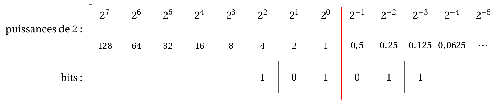

<link rel="stylesheet" href="../assets/style.css" />
<script src="https://cdn.jsdelivr.net/npm/mathjax@3/es5/tex-mml-chtml.js"></script>

# Représentation des entiers à virgules

## Python fait-il des calculs corrects ?

### Mise en évidence

💻 Evaluer les instruction suivantes :  

```shell
>>>1.1 + 1.1
>>>1.1 + 1.1 + 1.1
```
Les résultats vous semble-t-ils normaux ?  

  
💻 Evaluer les instruction suivantes :  

```shell
>>>0.1 + 0.1 - 0.2
>>>0.1 + 0.1 + 0.1 - 0.3
```
Les résultats vous semble-t-ils normaux ?  


💻 Evaluer les instruction suivantes :  

```shell
>>>3 + 10**(-16) == 3
>>>3 + 10**(-15) == 3
```

Les résultats vous semble-t-ils normaux ?  
    
  
<details>
  <summary style="cursor: pointer; font-weight: bold;">BILAN</summary>
  <div style="margin-top: 10px;">
    <p>Les ordinateurs ne travaillent qu’en binaire (0 et 1). Or, certains nombres décimaux ne peuvent <strong>pas être représentés exactement</strong> en binaire, de la même façon que \( \frac{1}{3} = 0.333333 \) ne peut pas s’écrire exactement en base 10.</p>
  </div>
</details>

### Prendre connaissance

En Python, un nombre flottant est du type `float`.

```
>>> type(0.5)
<class 'float'>
```

## Écriture binaire vers décimale

Comme pour les entiers, on utilise le système binaire, qu'on prolonge à la partie à droite de la virgule par les puissances négatives de 2.

<div style="display: flex; flex-direction:column;  border: 1px solid #ccc; text-align: center; border-radius: 8px; ">
   Base 10" width="1000" />
</div>

**Exemple :** Que vaut $$101{,}011_2$$ en décimal ?

<details>
  <summary style="cursor: pointer; font-weight: bold;">🖋️ Correction</summary>
  <div style="margin-top: 10px;">
    <p>$$101{,}011_2 = 1 \times 2^2 + 0 \times 2^1 + 1 \times 2^0 + 0 \times 2^{-1} + 1 \times 2^{-2} + 1 \times 2^{-3} = 4 + 1 + 0{,}25 + 0{,}125 = 5{,}375$$</p>
  </div>
</details>

### Généralisation

> <span style="color:red;">
 La valeur en base 10 du nombre qui s’écrit  
 $$ a_n \ldots a_2 a_1 a_0 , b_1 b_2 b_3 \ldots $$   
 en base \(x\) est donnée par la relation :
</span>
>
><span style="color:red;">
$$
a_n \ldots a_2 a_1 a_0 , b_1 b_2 b_3 \ldots = a_n \times x^n + \ldots + a_2 \times x^2 + a_1 \times x^1 + a_0 \times x^0 + b_1 \times \frac{1}{x^1} + b_2 \times \frac{1}{x^2} + b_3 \times \frac{1}{x^3} + \ldots
$$
</span>
>
><span style="color:red;">
Cette relation permet de calculer la valeur en base dix d’un nombre à virgule écrit en base 2.
</span>
>

## Écriture décimale vers binaire

A la manière des divisions successives, l'obtention de la partie décimale d'un nombre à virgule se trouve *simplement*, par une méthode de multiplications par 2 successives.

**Exemple**

Prenons le nombre $$3,6875_10$$. Il comporte une partie entière (3), et une partie décimale (0,6875).

* On écrit la partie entière "comme d'habitude" : $$ 3_10 = 11_2 $$.
* On convertit la partie décimale par des multiplications successives par 2 :

<div style="display: flex; flex-direction:column;  text-align: center; ">
  
</div>

* On prend les parties entières des résultats dans l'ordre: $$0,6875 = 0, 1011_2$$

→ Donc $$3,6875_10 = 11, 1011_2$$

### Remarque

>Un nombre qui a un nombre de chiffre après la virgule fini lorsqu'on l'écrit en base 10, peut avoir un nombre de chiffre après la virgule infini lorsqu'on souhaite l'écrire en base 2.
>
>Le nombre de bits utilisé pour le codage d'un nombre à virgule étant limité, il y a nécessairement des arrondis. C'est cela qui explique les problèmes de calculs qui ont été soulevés dans la paragraphe I.
>

---

> ## Applications
>
> ### Application I : S'entrainer pour bien comprendre
>
>1) Donner en base 10 la valeur du nombre à virgule qui s'écrit 111,111 en binaire.
>
>2) Donner en base 10 la valeur du nombre à virgule qui s'écrit 1010,1010 en binaire.
>
>3) Écrire, en binaire, le nombre dont la valeur en base 10 est 5,25 (on s'arrêtera à 4 bits pour la partie décimale).
>
>4) Écrire, en binaire, le nombre dont la valeur en base 10 est 8,8 (on s'arrêtera à 4 bits pour la partie décimale).
>
>