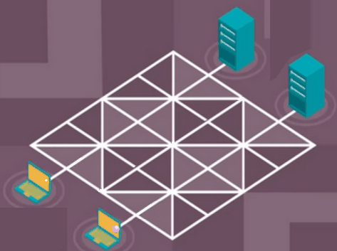
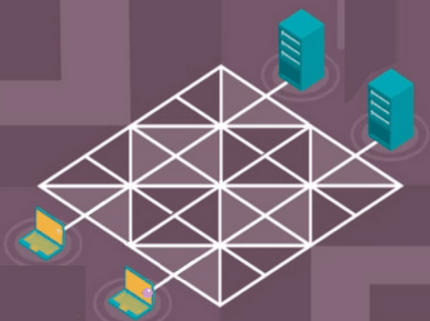
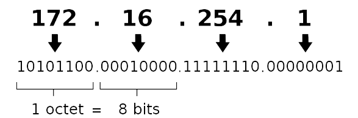

<link rel="stylesheet" href="../../assets/style.css" />

# Généralités

Le transfert de données entre les équipements nécessite que ces équipements suivent les mêmes règles, en informatique on parle de **protocole**.

Un protocole est un ensemble de règles permettant d'établir, mener et terminer une communication entre deux machines informatiques.

 

Afin de permettre une meilleure compréhension, ces protocoles ont été regroupés en fonction de leurs rôles. Par ailleurs, les protocoles ont été conçus pour être indépendants les uns des autres et hiérarchisés. C'est pourquoi on parle de **couches**.

Il existe plusieurs modèles, celui que nous évoquerons est le **modèle TCP/IP**. *( vu en seconde )*

## Les couches du modèle TCP/IP

| Nom | Rôle des protocoles | Exemples de protocoles | Nom de l'élément transféré |
|---|---|---|---|
| Couche Application | Assurer la continuité de service entre deux machines pour une application ou une fonctionnalité spécifique. | HTTP, POP, IMAP, etc. | Donnée |
| Couche Transport | Assurer l'échange des données (efficacité, absence d'erreurs...) entre deux applications spécifiques de deux équipements, les applications étant identifiées par un numéro de port. | TCP, UDP, etc. | Datagramme / Segment |
| Couche Internet/Réseau | Assurer le routage (acheminement de proche en proche) des paquets entre deux équipements appartenant à des réseaux différents, les équipements sont repérés par leurs adresses IP. | IPv4, IPv6, ICMP, etc. | Paquet |
| Couche Accès réseau | Assurer l'acheminement des trames entre deux équipements d'un même réseau, les équipements étant repérés par leurs adresses MAC. | Ethernet, Wifi, etc. | Trame |

## Passage d'une couche à l'autre

### Émission des données

Lorsqu'une application d'un équipement doit transmettre une donnée à l'application d'un autre équipement :

- Elle transfert cette donnée à la couche transport.
- La couche transport ajoute les informations nécessaires à la donnée et transfert l'ensemble à la couche réseau.
- La couche réseau fait de même en ajoutant encore quelques informations et transfert l'ensemble à la couche lien.
- La couche lien fait de même vers la couche physique.
- Finalement, la couche physique du premier équipement envoie les 0 et les 1 à la couche physique de l'autre équipement.  

On parle ici d'un **processus d'encapsulation**.

Les informations ajoutées par chaque couche sont principalement placées avant les informations reçues de la couche précédente, c'est pourquoi on parle d'entête (Head en anglais).

### Réception des données

Lorsque la machine de destination reçoit les 0 et les 1, le processus inverse s'opère : chaque couche récupère les informations et l'entête qui la concerne, supprime cette entête, traite les informations et transfert le restant à la couche supérieure.

On parle ici de **décapsulation**.

### Synthèse

Lien : http://numerique.ostralo.net/reseau/index.htm

## Couche Transport : exemple du protocole TCP 

### Activité : Pourquoi découper les données ?

Considérons les deux modes d'acheminement des données présentés ci-dessous :

  
  

 

**Travail à faire** 🖋️ : A partir de ces animations, expliquer l'intérêt de découper les données en petits morceaux.

L'une des fonctions du protocole TCP est :

- du côté de l'émetteur : de découper une données en morceaux (appelés segments)
- du côté du récepteur : de reconstituer la donnée à partir des morceaux.

## Couche réseau : Le routage

Les protocoles de la couche réseau ont pour fonction de guider les paquets de routeur en routeur, puis jusqu'à sa destination.

Pour cela, chaque machine d'un réseau dispose d'une adresse, appelée adresse IP

Dans la version 4, les adresses IP sont constitués de 4 octets séparés par des points :

  
   
  Format d'une adresse IPv4

 

Chaque routeur du réseau dispose des informations qui lui permettent d'orienter le paquet vers le routeur suivant le plus adapté.

## Activité débranchée : Simulation de communications Client/Serveur

### Rôle du protocole TCP

Le protocole TCP de la couche transport à plusieurs rôles :

- il permet d'identifier le programme (le service) d'une machine avec lequel communiquer (à l'aide du port),
- de découper les données à envoyer en segments, et de les réassembler à destination,
- de gérer les pertes de transmission.

### Mise en place de la communication

Ce mécanisme commence toujours par une mise en place de la connexion

- Le client choisi un numéro de séquence aléatoire et envoie une demande de synchronisation avec ce numéro (SYN, numClient).
- Le serveur qui reçoit cette demande incrémente le numéro de séquence du client et génère à sont tour un numéro aléatoire. Il répond avec un accusé de réception (ACK, numClient+1, numServeur).
- Le client renvoie à son tour un accusé de réception après avoir incrémenté les deux numéros (ACK, numClient+2, numServeur+1).

Tout ce processus a pour but de permettre au client et au server de s'échanger deux numéros de séquences.

### Activité : différentes situations

Dans les prochaines situations, les données peuvent être en un ou plusieurs morceaux.

#### Situation 1 

Après la connexion :
- Pour chaque morceaux, un segment (datagramme) est créé avec le numéro de séquence incrémenté de l'émetteur. L'ensemble est envoyé.
- Le serveur va répondre avec un accusé de réception pour chaque segment, avec le numéro de séquence de l'émetteur.

#### Situation 2

Après la connexion :
- Pour chaque morceaux, un segment (datagramme) est créé avec le numéro de séquence incrémenté de l'émetteur. L'ensemble est envoyé, MAIS, un des segment est perdu en chemin.
- Le serveur va répondre avec un accusé de réception pour chaque segment, SAUF celui qui a été perdu et donc non reçu par le serveur.
- Au bout d'un certain temps, le client renvoie le segment manquant.
- Le serveur répond avec l'accusé de réception du segment.

#### Situation 3

Après la connexion :
- Pour chaque morceaux, un segment (datagramme) est créé avec le numéro de séquence incrémenté de l'émetteur. L'ensemble est envoyé.
- Le serveur va répondre avec un accusé de réception pour chaque segment, SAUF UN, qui a été perdu et donc non reçu par le serveur.
- Au bout d'un certain temps, le client renvoie le segment dont il n'a pas reçu l'accusé de réception.
- Le serveur répond avec l'accusé de réception du segment.

#### Situation 4

Après la connexion :
- Un segment (datagramme) est créé avec le numéro de séquence incrémenté de l'émetteur. Il est envoyé.
- A cause d'une mauvaise connexion, celui-ci n'est toujours pas arrivé au bout du temps accordé, un autre est renvoyé.
- Le serveur va répondre avec un accusé de réception pour le dernier segment envoyé.
- Au bout d'un certain temps, le serveur reçoit le PREMIER segment envoyé.
- Le serveur le détruit

### Cloture de la communication

Lorsque la transmission est terminée, la communication est fermée.

Remarques :

- Le découpage en segments permet de n'avoir à renvoyer qu'une partie de la donnée en cas de perte lors de la transmission.
- Si les segments d'arrivent pas dans le bon ordre, les numéros de séquences de l'émetteur permettent des les réordonner.
