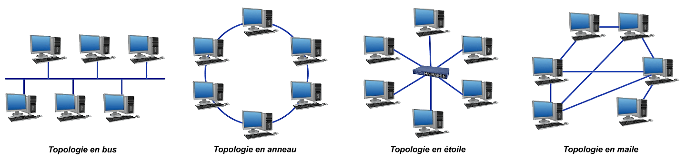
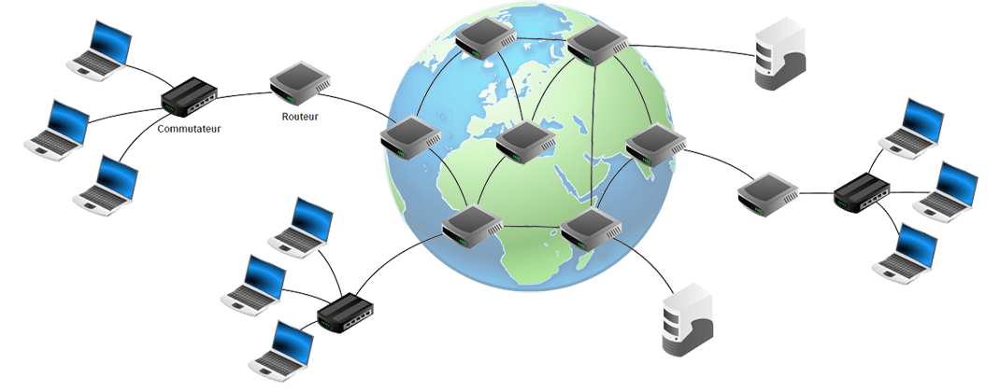
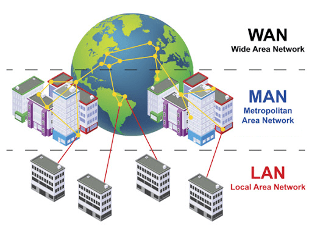
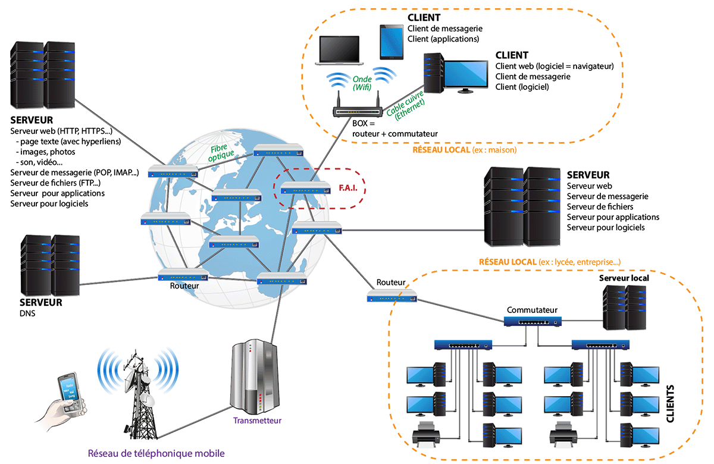

<link rel="stylesheet" href="../../assets/style.css" />

# Prendre connaissance

<strong>Qu'est-ce qu'un réseau ?</strong> 
Un <strong>réseau informatique</strong> est un ensemble d'équipements (ordinateur, routeur, switch, etc) reliés par des connexions (câbles de cuivre, fibres optiques, liaisons satellites, ondes radios, etc.) en vu d'échanger des données.

## Topologies d'un réseau

Il existe plusieurs façon de relier des machines informatiques entre elles.

  
  Quelques topologies de réseaux

## Équipements d'un réseau

  
  Quelques équipements d'un réseau

### Les équipements terminaux

- **Serveur**
- **Ordinateur** de bureau, ordinateur portables...
- Périphériques (imprimante, scanner...)
- Téléphones portables...
- Objets connectés...
- ...

### Les équipements intermédiaires
- Les **concentrateurs** (hub) : dispositif réseau de base qui connecte plusieurs appareils dans un réseau local (LAN) en agissant comme un point central de transmission.
- Les **commutateurs** (switch) : ces équipements permettent de relier plusieurs ordinateurs entre eux ;
- Les **routeurs** : cet équipement permet la création de sous-réseaux et l'interconnexion des sous-réseaux. Il participe également au routage des données, c'est à dire à l'acheminement des données de proche en proche dans le réseau.

### Les connexions
Il existe plusieurs moyens techniques pour relier les équipements :

- la **connexion par cable** en cuivre (ex : cable éthernet)
- la **connexion par fibre optique**
- la **connexion par ondes** (wifi, bluetooth, GSM...)

## Classification en fonction de la taille

  

 

<strong>Réseau local, ou LAN (Local Area Network)</strong> 
Un réseau local est un réseau privé, qui fonctionnent sur zone géographique restreinte, comme une maison ou une entreprise.

 

Un réseau local est fréquemment utilisé pour partager des ressources (imprimante...) et échanger des informations.

> ## Application : bien utiliser le vocabulaire
>
> Compléter le schéma ci-dessous avec une légende la plus complète possible

  

