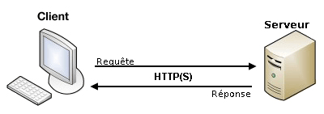
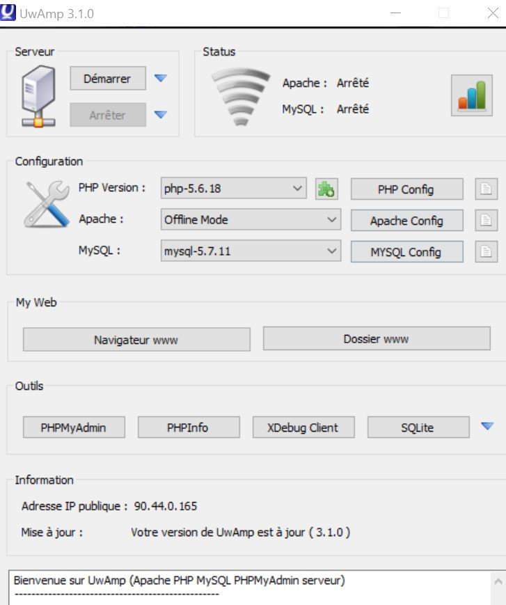
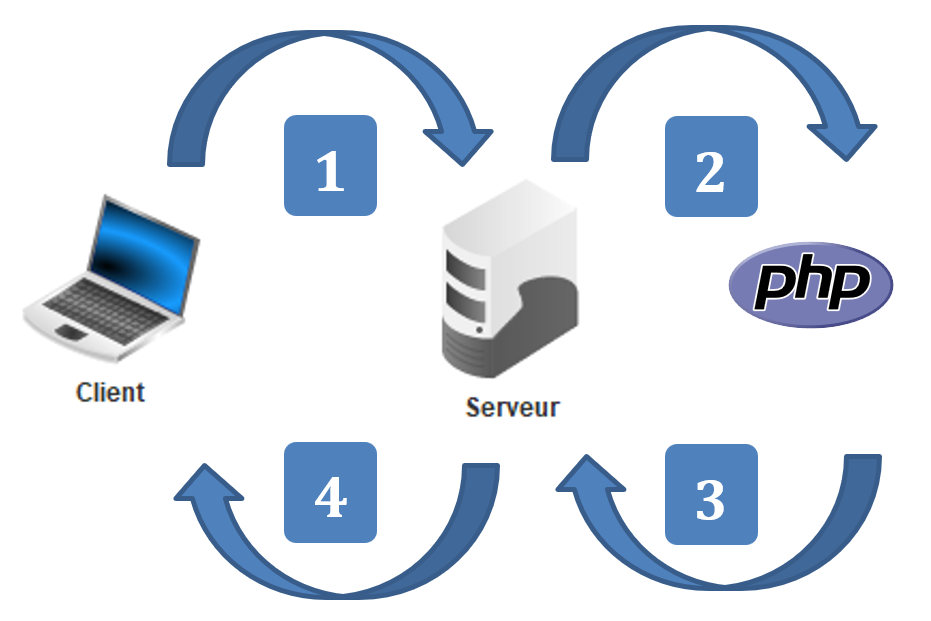

<link rel="stylesheet" href="../../assets/style.css" />
<script src="https://cdn.jsdelivr.net/npm/mathjax@3/es5/tex-mml-chtml.js"></script>

# Client, serveur, requête

## Introduction

Nous avons déjà vu rapidement le fonctionnement en client/serveur du web avec l’envoi de requêtes au serveur par le client. Nous allons maintenant approfondir les choses.

## Client
Un client est un ordinateur qui envoie une requête à un serveur. Cela peut être un utilisateur par l’intermédiaire d’un navigateur ou un programme (bot) qui envoie une requête. Nous nous intéressons ici seulement au protocole http.

## Requête
Quand vous saisissez une URL dans un navigateur, il convertit cette URL en une requête et l’envoie vers le bon serveur.

Par exemple cette URL https://www.debian.org/intro/about sera transformée en cette requête :

```
GET /intro/about HTTP/1.0
Host : www.debian.org
Accept : text/html,application/xhtml+xml,application/xml;q=0.9,*/*;q=0.8
User-Agent : Mozilla/5.0 (X11; Ubuntu; Linux x86_64; rv:70.0) Gecko/20100101 Firefox/70.0
…
```
Détaillons cette requête :

- la première ligne contient la commande (ici GET), l’URL et le protocole ;
- Les lignes suivantes sont les entêtes (headers) qui contiennent différentes informations ;
- Host : précise le site web concerné par la requête ;
- Accept : indique ce que le navigateur accepte comme type de contenu ;
- User-Agent : donne des informations sur le client.

Il existe beaucoup d’autres entêtes.

### Activité
>
> 1) Allez sur la page ci-dessus avec **Firefox** et notez cinq autres entêtes (seulement les noms) de la requête avec le moniteur réseau (`ctrl + shift + E`).
>

Nous avons vu la commande GET qui est la plus utilisée car elle demande simplement la ressource. Il existe également une commande POST pour envoyer des données au serveur mais nous verrons ceci en détail dans le prochain chapitre. La commande HEAD permet de ne demander que les entêtes pour faire des tests par exemple.

## Serveur

Un serveur est aussi un ordinateur. Il n’est pas nécessairement puissant : votre téléphone peut être un serveur, un ordinateur de plus de dix ans, un Raspberry Pi. L’ordinateur que vous utilisez actuellement est un serveur (nous l’utiliserons plus tard).

Il existe des ordinateurs spécialement conçus pour être des serveurs avec beaucoup (beaucoup) de mémoire et beaucoup de processeurs. Ces serveurs sont en général situés dans des datacenters, des bâtiments spéciaux climatisés avec une très bonne connexion internet :

Les serveurs dans les datacenters peuvent être loués à des particuliers ou des entreprises.

### Activité
>
> 2) Allez sur le site d’OVH (leader européen situé à Roubaix) et relevez les caractéristiques (nombre de cœurs, RAM et disques) du plus cher serveur : <a href="https://www.ovh.com/fr/serveurs_dedies/tarifs/" target="_blank">https://www.ovh.com/fr/serveurs_dedies/tarifs/</a>
> 

Alors comment faire pour qu’un ordinateur devienne un serveur web ? Il suffit d’y installer **un logiciel qui répond aux requêtes http** ! Il existe des dizaines de tels logiciels, les plus répandus sont les logiciels libres **Apache** et **Nginx**. Le logiciel que nous allons utiliser aujourd'hui (**Uwamp**) va nous permettre d'utiliser Apache pour nos serveurs.

## Réponse

Une fois que le serveur a reçu une requête il renvoie une réponse. Si on continue avec la même requête, voici un extrait de la réponse :

```
HTTP/2 200 OK
date: Tue, 04 May 2021 14:40:31 GMT
server: Apache
content-location: about.fr.html
…
<!DOCTYPE HTML PUBLIC "-//W3C//DTD HTML 4.01//EN" "http://www.w3.org/TR/html4/strict.dtd">
<html lang="fr">
<head>
…

```
Détaillons cette réponse :

- la première ligne contient le protocole (HTTP/2) et le code de réponse (200 OK)
- Les lignes suivantes sont encore des entêtes (headers) qui contiennent différentes informations.
- Date : la date et l’heure de la réponse ;
- Server : le type de serveur ;

Et beaucoup d’autres entêtes.

Enfin après une ligne vierge, il y a la ressource demandée : ici la **page HTML**.


Voici ce que vous devez retenir de ces échanges client/serveur :

<div style="display: flex; flex-direction:column;  text-align: center; ">
  
</div>
<br>

### Activités
>
> 3) Allez sur les sites de Debian et de l’ENT et notez les serveurs utilisés en regardant les entêtes dans Firefox.
>
> 4) De même, trouvez le serveur utilisé par Google et chercher son nom complet.
>
> 5) Cherchez la signification des codes de réponse suivants :
>
> - 200
> - 404
> - 410
> - 403
> - 500

---

> **Solutions**
>
> 3)
> 
> 4) gws
>
> 5) 
>
> - 200 : succès de la requête ;
> - 404 : ressource non trouvée ;
> - 410 : ressource définitivement supprimée;
> - 403 : accès refusé ;
> - 500 : erreurs serveur ;

## Serveur local

Un serveur ne fournit pas nécessairement des page HTML « statiques ». Il peut **exécuter du code avant de fournir une page**. Ce code peut être du **Python ou du Java** par exemple. Nous utiliserons **PHP** car il est très répandu et reste assez simple d’utilisation.

### Héberger votre site sur un serveur.

Nous utiliserons le **serveur UwAmp** (Serveur Wamp Apache, mySQL, PHP, SQLite). Il existe bien d’autre possibilités : Wamp, Laragon, IIS, nginx...

😊 Aujourd’hui le serveur se trouve aussi sur votre machine. Le fonctionnement est identique à celui d’un serveur hébergé à distance.

<div style="display: flex; flex-direction:column;  text-align: center; ">
  
</div>
<br>

👉 **Activer UwAmp** : Cliquer sur l’icône de UwAmp, puis sur Démarrer si nécessaire.

Vous devez obtenir ceci :

<div style="display: flex; flex-direction:column;  text-align: center; ">
  
</div>
<br>

👉 Cliquer sur le **bouton "Dossier www"**, puis ajouter un dossier à votre nom, par exemple le dossier *Dupond*

👉 Copier le fichier que vous venez de créer `page_web.html` dans ce dossier à votre nom.

👉 Double-cliquer sur ce fichier `page_web.html` .

>
> 6) Où est interprété ce fichier ? Par quel programme ?
>
---
> **Solution**
>
> 6) Le fichier est interprété localement sur votre ordinateur par votre navigateur.
> 


👉 Revenez sur UwAmp, et cliquer sur le bouton "Navigateur www"

Vous devez obtenir quelque chose qui ressemble à ceci :

<div style="display: flex; flex-direction:column;  text-align: center; ">
  
</div>
<br>

👉 Cliquer sur votre dossier, vous devez obtenir quelque chose qui ressemble à ceci :

<div style="display: flex; flex-direction:column;  text-align: center; ">
  
</div>
<br>

👉 Double-cliquer sur ce fichier `page_web.html`.

>
> 7) Où est interprété ce fichier ? Par quel programme ?
>
---
> **Solution**
>
> 7) Ce fichier est interprété par le serveur UwAmp.
> 

### Premier script PHP

👉 Ecrire le fichier PHP suivant avec un éditeur de texte (Visual Studio Code, ou Notepad++ ou autre) et l’enregistrer sous le nom `affichages.php` sur votre session.

```PHP

<!DOCTYPE html>
<html>
 <head>
  <meta charset="utf-8"/>
    <title> Affichages  </title>
 </head>
<body>
  <p> Ceci est un affichage écrit en HTML </p>

<?php
echo "Ceci est un affichage écrit en PHP";
?>
</body>
</html>
```

👉 Ouvrez votre fichier avec votre navigateur

>
> 8) Qu'obtenez-vous ?
>
---
> **Solution**
>
> 9) On voit le code du fichier.
> Le navigateur ne sait pas interpréter un ficihier .php
> 

👉 Ouvrez votre fichier dans le serveur, en procédant comme précédemment pour copier votre fichier sur le serveur, et le lire sur le serveur.

>
> 9) Qu'obtenez-vous ?
>
---
> **Solution**
>
> 7) 
>
```
Ceci est un affichage écrit en HTML
Ceci est un affichage écrit en PHP
```
> 

## Bilan

<div style="display: flex; flex-direction:column;  text-align: center; ">
  
</div>
<br>

- **Etape 1** : Le navigateur envoie l'adresse que l'utilisateur a saisie (demande d’une page html ou php).

- **Etape 2** : Apache (le serveur web) cherche dans son arborescence (www) si le fichier existe, et si celui-ci porte une extension reconnue comme une application PHP. Si c'est le cas, Apache transmet ce fichier au parseur PHP.

- **Etape 3** : PHP interprète le fichier, c'est-à-dire qu'il va analyser et exécuter le code PHP qui se trouve entre les balises :
`<?` PHP et `?>`

- **Etape 4** : Le serveur web renvoie un fichier ne contenant plus de code PHP, donc le résultat sous forme de page HTML au navigateur qui l'interprète et l'affiche.