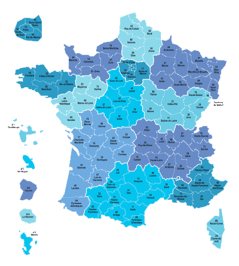

<link rel="stylesheet" href="../../assets/style.css" />

# Introduction

Les données constituent la matière première de toute activité numérique. Afin de permettre
leur réutilisation, il est nécessaire de les conserver de manière persistante. Les structurer
correctement garantit que l’on puisse les exploiter facilement pour produire de l’information.  

Cependant, les données non structurées peuvent aussi être exploitées, par exemple par les
moteurs de recherche.

## Repères historiques

- 1930 : utilisation des cartes perforées, premier support de stockage de données ;
- 1956 : invention du disque dur permettant de stocker de plus grandes quantités de
données, avec un accès de plus en plus rapide ;
- 1970 : invention du modèle relationnel (E. L. Codd) pour la structuration et
l’indexation des bases de données ;
- 1979 : création du premier tableur, VisiCalc ;
- 2009 : Open Government Initiative du président Obama ;
- 2013 : charte du G8 pour l’ouverture des données publiques

## Activité

  

La page suivante propose le téléchargement des données contenant la liste des départements et de leurs régions : <a href="https://www.data.gouv.fr/datasets/departements-et-leurs-regions" target="_blank">Départements et leurs régions</a>

> 1/ Analyse de la page
>
> 1.a Quels sont les trois formats de données proposés au téléchargement ?
> 
> 1.b Sous quelles conditions peut-on réutiliser ces données ?
> 
> 2/ Analyse des fichiers de données
>
> Télécharger les trois fichiers proposés et les ouvrir dans un éditeur de texte comme NotePad ++ ou le BlocNote.
> 
> 2.a Le fichier de données au format CSV utilise-t-il la virgule ou le point-virgule comme séparateur ?
>
> 2.b Lister les descripteurs de la collection.
>
> 2.c Les descripteurs sont-ils les mêmes dans les trois fichiers ?
>
> 2.d Indiquer le nombre d'objets stockés.