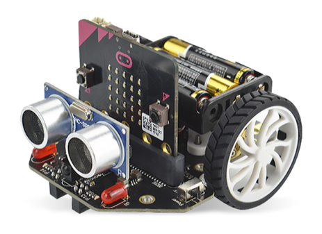

# TP : Robot Maqueen

## Utiliser le robot Maqueen sur Python

<div style="display: flex; flex-direction:column;  text-align: center; ">
  
</div>
<br>

Le robot Maqueen micro:bit est un robot très bon marché (autour de 20€) contrôlé par la carte micro:bit. Il est petit, maniable et facile d'utilisation. Il possède beaucoup de fonctionnalités :

- capteurs de suivi de ligne

- LEDs

- 4 LED RVB neopixel pour éclairage d'ambiance

- capteur de distance ultrason

- buzzer pour effets sonores

- moteurs à engrenage contrôlables séparément par i2c

- alimentation par pack de 3 piles AAA

- capteur infrarouge permettant au robot d'être télécommandé

A l'origine, ce robot se programme par blocs. Nous allons utiliser un module python permettant de le programmer facilement sous EduPython également.

## Installation du module pilote maqueen sous Python

Pour installer le module sur Edupython :


- Créez un dossier de travail `Maqueen` dans votre répertoire `SNT`
- Téléchargez le module <a href="maqueen.zip">maqueen.zip</a> et décompressez-le dans votre dossier 'Maqueen'
- Ouvrez Edupython, puis ouvrez le fichier `maqueen.py`


## Méthodes fournies par le module

- `avance(vitesse)` : avance en ligne droite. vitesse est un nombre entre 0 et 100. Ce paramètre est optionnel. Si non spécifié, c'est la dernière vitesse spécifiée lors de avance() ou setVitesse() qui sera utilisée.

- `recule()` : fait marche arrière.

- `stop()` : stoppe les moteurs

- `moteurDroit(vitesse)` : fait tourner la roue droite.

- `moteurGauche(vitesse)` : fait tourner la roue gauche.

- `getVitesse()` : renvoie la vitesse paramétrée par setVitesse() ou avance()

- `setVitesse()` : change la valeur de la vitesse utilisée par avance, recule, moteur*

- `distance()` : renvoie la distance (en cm) lue par le capteur ultrason

- `son_r2d2()` et `son_bip()` : effets sonores

Pour utiliser ces fonctions, vous devrez utilisez ce début de code **obligatoirement** pour manipuler la voiture:

```python
from maqueen import Maqueen

mq=Maqueen()
mq.avance(10)
...
```

## Complément : Accès aux autres fonctions du robot

Sur le circuit imprimé du robot figurent les adresses des broches pour les LEDs et capteurs de ligne. les voici pour rappel :

- LEDs rouges : 8 (gauche) et 12 (droite). Ex : pin8.write_digital(1)

- Neopixel : pin15

- capteurs de ligne : pin13 (gauche) et pin14 (droite). ex : pin13.read_digital()

- infrarouge : pin16

```python
# Exemple d'éclairage d'ambiance vert avec les neopixels

from microbit import *

from neopixel import NeoPixel

np=NeoPixel(pin15,4)

for i in range(4):

    np[i]=(0,255,0)

np.show()


# np.clear() pour eteindre les neopixels
```

## Projet

Vous utiliserez Edupython pour écrire et sauvegarder votre code, mais python.microbit.org pour le télécharger sur la carte microbit à mettre dans la voiture Maqueen.

### Partie Code

Par groupe de 3 ou 4: 

- **Palier 1** ★ : Réalisez un programme pour faire rouler automatiquement la voiture Maqueen dans la salle de cours, sur une courte distance. Elle devra respecter le programme suivant :
    - Avancer en ligne droite ;
    - Se stopper;
    - Faire un demi-tour droit (ou gauche);
    - Avancer à nouveau en ligne droite ;
    - Etc...

```python

from maqueen import Maqueen

mq=Maqueen()

mq.distance() # permet de vérifier le module ultrason

mq.avance(10)

mq.stop()

mq.moteurDroit()

mq.moteurGauche(-10)

mq.stop()
```

- **Palier 2** ★★ : Utilisez les leds de la carte et de la voiture pour indiquer la direction et le sens que prend la voiture Maqueen.

```python

```

- **Palier 3** ★★★ : Utilisez les capteurs de la voiture pour détecter une ligne continue noire sur une feuille blanche, et faites en sorte que la voiture suive cette ligne noire.

```python

from microbit import *
from maqueen import Maqueen

robot = Maqueen()

# Vitesse de base
VITESSE = 35
VITESSE_TOURNE = 25

# Capteurs de ligne
# Très souvent :
# pin13 = capteur gauche
# pin14 = capteur droit
capteur_gauche = pin13
capteur_droit = pin14

while True:
    gauche = capteur_gauche.read_digital()
    droit = capteur_droit.read_digital()

    # Cas le plus fréquent :
    # 0 = noir détecté
    # 1 = blanc détecté

    if gauche == 0 and droit == 0:
        # Les deux voient la ligne : avance
        robot.moteurGauche(VITESSE)
        robot.moteurDroit(VITESSE)
        display.show(Image.ARROW_N)

    elif gauche == 0 and droit == 1:
        # La ligne est à gauche : corrige vers la gauche
        robot.moteurGauche(VITESSE_TOURNE)
        robot.moteurDroit(VITESSE)
        display.show(Image.ARROW_W)

    elif gauche == 1 and droit == 0:
        # La ligne est à droite : corrige vers la droite
        robot.moteurGauche(VITESSE)
        robot.moteurDroit(VITESSE_TOURNE)
        display.show(Image.ARROW_E)

    else:
        # Ligne perdue
        robot.stop()
        display.show(Image.NO)

    sleep(20)

```
### Partie Questions

Chaque question est à répondre sur un document à rendre lors de la dernière séance de projet.

1. Quelles sont :

    - les actionneurs sur la voiture Maqueen ? 
    - les capteurs sur la voiture Maqueen ?
    - les actionneurs sur la carte Microbit ? 
    - les capteurs sur la carte Microbit ?

2. Qu'est ce que l'IoT ( Internet of Things ) ?

