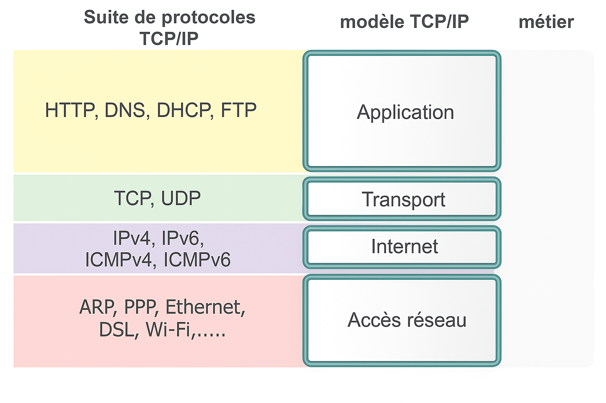
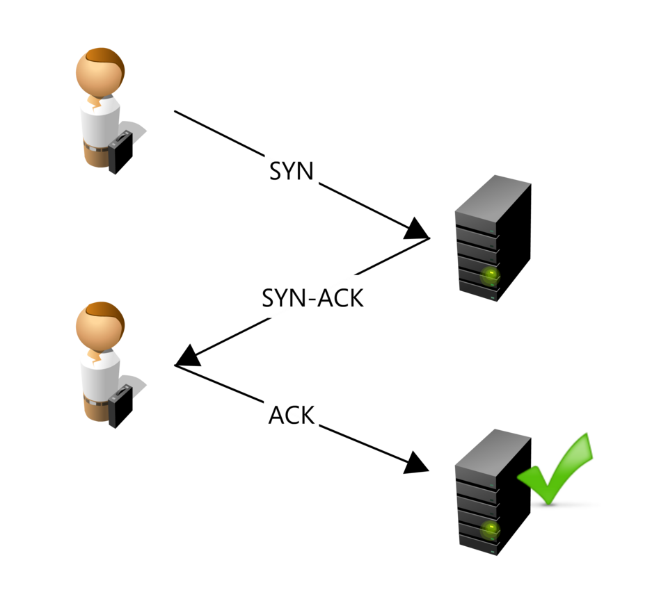

# Modèle TCP/IP

## Couches TCP/IP

  

## TCP 

### Rappel : "Protocole" en informatique

Un protocole est un ensemble des règles que les machines d'un réseau vont suivre, dans le but de transmettre des données.

### Le protocole TCP

Le protocole TCP garanti que les données reçues sont identiques à celles envoyées.

Pour cela, il s'appuie sur les taches suivantes :

- découpage du paquet en segments,
- bonne réception de chaque segments,
- destruction des segments perdus,
- réémission des segments non reçus,
- réassemblage des segments,
- détection des erreurs…

### Connexion : Triple poignets de mains

La triple poignet de main TCP (ou three-way handshake) est un processus fondamental du protocole TCP (Transmission Control Protocol) utilisé pour établir une connexion fiable et orientée connexion entre deux appareils sur un réseau TCP/IP.

  

- SYN : Le client qui désire établir une connexion avec un serveur va envoyer un premier paquet SYN (synchronized) au serveur. Le numéro de séquence de ce paquet est un nombre aléatoire A.
- SYN-ACK : Le serveur va répondre au client à l'aide d'un paquet SYN-ACK (synchronize, acknowledge). Le numéro du ACK est égal au numéro de séquence du paquet précédent (SYN) incrémenté de un (A + 1) tandis que le numéro de séquence du paquet SYN-ACK est un nombre aléatoire B.
- ACK : Pour terminer, le client va envoyer un paquet ACK au serveur qui va servir d'accusé de réception. Le numéro de séquence de ce paquet est augmenté de 1 par rapport au dernier qu'il a envoyé (soit A + 1), et le numéro du ACK est égal au numéro de séquence du paquet précédent (SYN-ACK) incrémenté de un (B + 1).