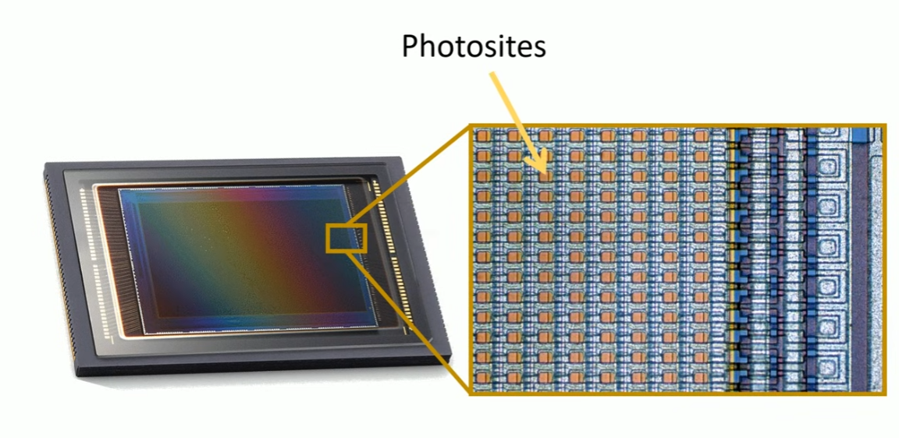

<link rel="stylesheet" href="../../assets/style.css" />

# Cours : Photosites et Matrice de Bayer

## Définition : Photosite

Un **photosite** est **une minuscule cellule sensible à la lumière** qui compose le **capteur d’un appareil photo numérique** ( exemple de capteur : **Capteur Charge-Coupled Device** ).
  
Chaque photosite capte la lumière reçue pendant la prise de vue et la transforme en signal électrique. Ce signal sera ensuite converti en données numériques pour former l’image.

## Matrice de Bayer

Comme les photosites ne perçoivent pas les couleurs, juste la quantité de lumière, il a fallu trouver une solution pour éviter les photos en noir et blanc → ici, la Matrice de Bayer !

La matrice de Bayer est une organisation de filtres colorés (Rouge, Vert, Bleu) placés sur les photosites du capteur.

On remarque :

- 2 filtres verts
- 1 filtre rouge
- 1 filtre bleu

Ce motif ce répète sur toute la matrice !

→ Chaque photosite ne pourra avoir l’information que d’une seule couleur, celle de son filtre.

L’appareil photo reconstitue ensuite les couleurs complètes grâce à un calcul appelé **dématriçage.**  

Une vidéo très bien faite pour approfondir : https://www.youtube.com/watch?v=Rs5ab3X9Oxo