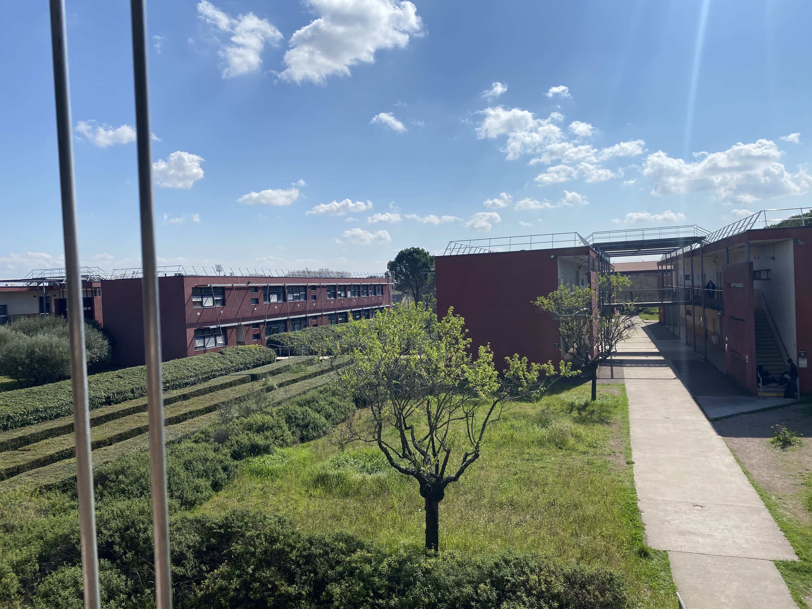
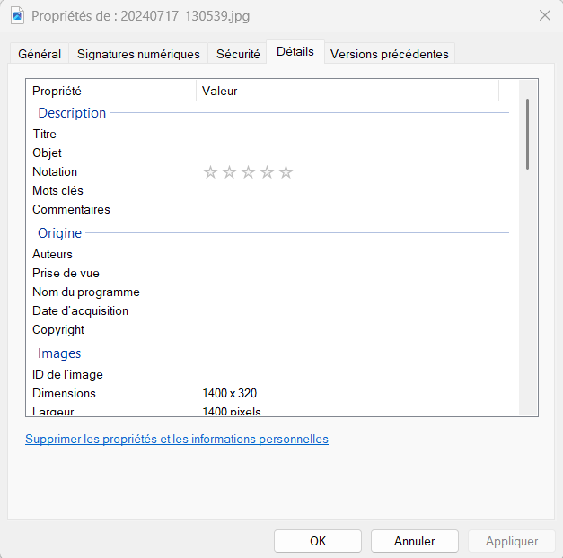
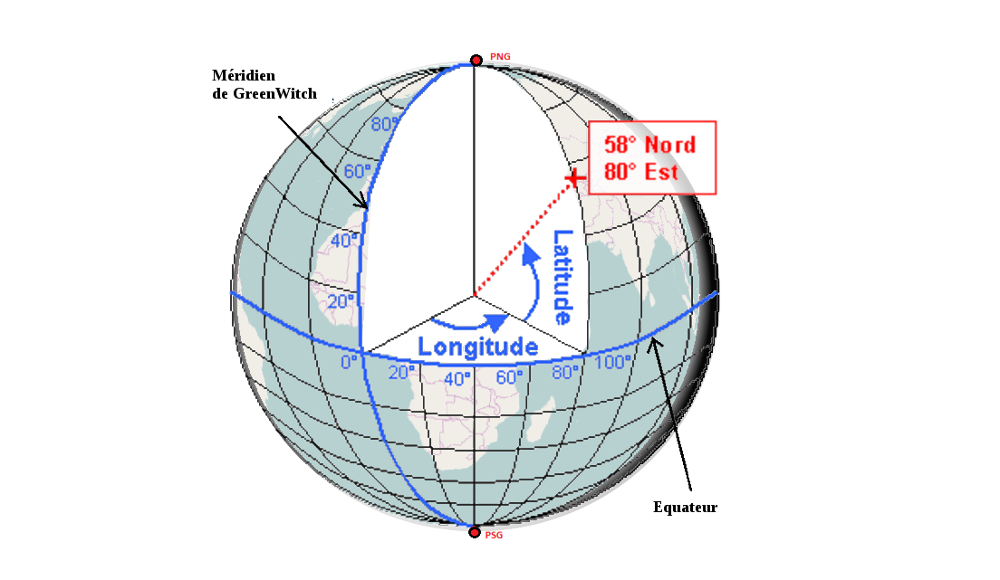

<link rel="stylesheet" href="../assets/style.css" />

# Données EXIF d'une photographie

## Présentation

Le fichier numérique d'une photographie ne contient pas uniquement les informations sur les couleurs des pixels.

Il peut également contenir le nom de l'appareil qui a servi à prendre la photo, la date de la prise de vue, si un flash a été utilisé... Ces informations s'appelles les **métadonnées**.

Pour les fichiers de photographies, les métadonnées sont enregistrées dans un format appelé **EXIF (Exchangeable Image File Format)**.

## Récupérer les données EXIF d'une photographie

### 1) Manipulations 💻

Voici une image du lycée, trouvez les informations liées à cette photographie.

  

 

- Enregistrez l'image sur votre ordinateur, dans le dossier SNT *(Clique droit sur la photo -> Sauvegardez l'image )* .

- Dans votre dossier SNT, ouvrez les propriétés de votre image par un clique droit sur la photo, onglet **Propriétés**.

- Cliquez et ouvrez l'onglet **Détails**.

  

 

➥ Les données s'affichent selon plusieurs catégories.

### 2) Compte-rendu 🖋️

*A rédiger à l'aide d'un traitement de texte et à enregistrer dans votre espace numérique*
>
> 1. Avec quel modèle d'appareil la photographie a-t-elle été prise ?
>
> 2. A quelle date et à quelle heure la photographie a-t-elle été prise ?
>
> 3. Quelle est la définition de l'image ?
>

## Exploitation des informations de géolocalisation

### Informations

La position d'un point à la surface de la Terre est données par deux angles : la **longitude** et de la **latitude**.

  

Il existe plusieurs écritures pour exprimer les angles des coordonnées :

- L'**écriture en heures/minutes/secondes (écriture sexagésimale)**
- L'**écriture en degrés/minutes décimales**
- L'**écriture décimales**

➥ Dans un fichier EXIF les coordonnées sont exprimées en heures/minutes/secondes.

 

Le passage d'une écriture à l'autre se fait moyennant quelques petits calculs.

Par exemple, la valeur décimale s'obtient, à partir des heures/minutes/secondes, en faisant l'opération suivante : 

$$
angle_{dec} = heures + \frac{minutes}{60} + \frac{secondes}{3600}
$$
 
 

Plusieurs sites proposent de faire ces conversions pour vous. Par exemple : <a href="https://www.lecampingsauvage.fr/gps-convertisseur" target="_blank"> www.lecampingsauvage.fr/gps-convertisseur.</a>

### Manipulations 💻

#### Détermination de la latitude et de la longitude

• Relever les données EXIF (heures, minutes et secondes) correspondant aux coordonnées du point où la photographie a été prise.

• En vous aidant des informations, calculer les coordonnées en écriture décimale.

#### Affichage sur une carte

• Ouvrir le service de cartographie en ligne <a href="https://www.openstreetmap.org" target="_blank">openstreetmap</a>

• Dans la zone de recherche, entrer les coordonnées du point recherché sous la forme : **Latitude décimale, Longitude décimale**.

### Compte-rendu 🖋️

*A rédiger à l'aide du traitement de texte et à enregistrer dans votre espace numérique.*

>
> 1. Indiquer la longitude et la latitude, en heure/minute/seconde, de l'endroit où la photo a été prise.
>
> 2. En expliquant la conversion, déterminer la longitude et la latitude, en valeur décimale, de l'endroit où la photo a été prise.
>
> 3. Copier-coller une copie d'écran de la carte obtenue dans votre compte rendu.
>

## Bons usages des données EXIF

### Un peu de bon sens... 🖋️

*A rédiger à l'aide du traitement de texte et à enregistrer dans votre espace numérique.*
>
>❤ 1. Présenter une situation pour laquelle il est souhaitable que la photographie n'ait pas de données EXIF (on précisera la ou les données EXIF à supprimer).
>
>❤ 2. Présenter une situation pour laquelle il est intéressant que la photographie ait des données EXIF (on précisera les données EXIF intéressantes).
>

### Savoir utiliser son téléphone portable

*A faire sur sont téléphone portable.*

Rechercher sur votre téléphone portable comment mettre ou ne pas mettre les données EXIF (en particulier la géolocalisation) pour les photographies que vous prenez. 💻

*A rédiger à l'aide du traitement de texte et à enregistrer dans votre espace numérique.*

Indiquer succinctement la procédure à suivre sur votre compte-rendu. 🖋️

## Pour les plus rapides ! 

Voici où je suis partie en vacance : 

  

 

Grâce aux données Exif, enregistrez la photo et essayez de trouver la ville et le pays où je suis partie en vacances !

