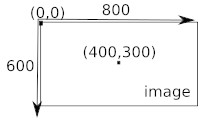
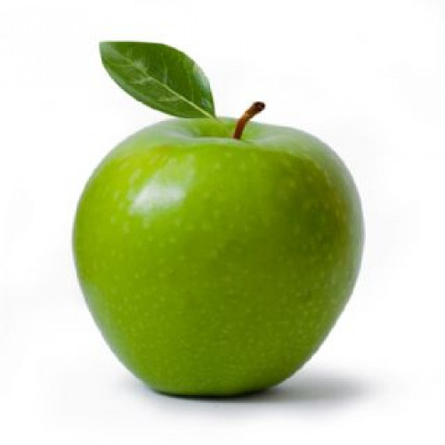

# TP : Traitement des images

Nous allons utiliser le langage de programmation Python afin de directement travailler sur les pixels d'une image. Par travailler sur les pixels, j'entends déterminer la valeur du **canal rouge**, la valeur du **canal vert** et la valeur du **canal bleu** pour un pixel donné ou bien encore modifier carrément la couleur d'un pixel.

Avant de commencer à écrire un programme qui nous permettra de travailler sur les pixels d'une image, il est nécessaire de préciser que chaque pixel a des **coordonnées x,y**.

<div style="display: flex; flex-direction:column;  text-align: center; ">
  
</div>

Comme vous pouvez le constater sur le schéma ci-dessus, le pixel de coordonnées **(0,0)** se trouve **en haut à gauche** de l'image. Si l'image fait **800 pixels de large et 600 pixels de haut**, le pixel ayant pour coordonnées **(400,300)** sera au **milieu de l'image**.

Dans un premier temps nous allons utiliser une simple photo de pomme pour faire nos premiers essais, ensuite, vous pourrez travailler avec l'image de votre choix. L'image de la pomme :

<div style="display: flex; flex-direction:column;  text-align: center; ">
  
  <span>(pour enregistrer l'image : clic droit, "Enregistrer l'image sous")</span>
</div>


<span style="color: rgb(255,0,0);">Attention ! </span>Cette image devra se trouver dans le même dossier que vos programmes Python.

## Premier programme :

Après avoir ouvert l'éditeur Edupython, saisissez et testez le programme suivant :

```python
from PIL import Image
img = Image.open("pomme.jpg")
r,v,b=img.getpixel((100,250))
print("canal rouge : ",r,"canal vert : ",v,"canal bleu : ",b)
```
Ce programme vous donne la valeur du <span style="color: rgb(255,0,0);">canal rouge</span>, le <span style="color: rgb(0,255,0);">canal vert</span> et le <span style="color: rgb(0,0,255);">canal bleu</span> du pixel de **coordonnées (100,250)** de l'image "pomme.jpg"

Voici une analyse ligne par ligne du programme ci-dessus :

- `from PIL import Image` : pour travailler sur les images nous avons besoin d'une extension de Python (appelé bibliothèque). Cette bibliothèque se nomme PIL.

- `img = Image.open("pomme.jpg")` c'est grâce à cette ligne que nous précisons que nous allons travailler avec l'image "pomme.jpg". Pour travailler avec une autre image, il suffit de remplacer "pomme.jpg" par un autre nom (attention, votre fichier image devra se trouver dans le même dossier que le ficher de votre programme Python).

- `r,v,b=img.getpixel((100,250))` cette ligne récupère les valeurs du canal rouge (r), du canal vert (v) et du canal bleu (b) du pixel de coordonnées (100,250). Dans la suite du programme, r correspondra à la valeur du canal rouge, v correspondra à la valeur du canal vert et b correspondra à la valeur du canal bleu

- `print("canal rouge : ",r,"canal vert : ",v,"canal bleu : ",b)` permet d'imprimer le résultat

> I. **Modifiez** le programme précédent pour qu'il affiche les valeurs du **canal rouge**, du **canal vert** et du **canal bleu** du **pixel de coordonnées (250,300)**, notez votre réponse. 💻

## Modifier les canaux RVB d'un pixel :

> **Saisissez** et **testez** le programme suivant : 💻

```python
from PIL import Image
img = Image.open("pomme.jpg")
img.putpixel((250,250),(255,0,0))
img.show()
```

**Regardez attentivement le centre de l'image, vous devriez voir un pixel rouge à la place d'un pixel vert.**

Voici une analyse ligne par ligne du programme ci-dessus :

- `img.putpixel((250,250),(255,0,0))` permet de colorier le pixel de coordonnées (250,250) en rouge (255,0,0).
- `img.show()` permet d'afficher l'image modifiée dans une nouvelle fenêtre.

> II. **Modifiez** le programme de l'activité précédente afin de colorier le pixel de coordonnées (100,250) en bleu. 💻

## Modifier les canaux RVB de plusieurs pixels :

Modifiez un pixel c'est déjà bien, mais comment faire pour modifier plusieurs pixels ? La réponse est simple, nous allons utiliser des boucles `for`.   
Le but ici n'est pas de détailler le fonctionnement des boucles `for` en Python, vous devez juste comprendre que grâce à ces boucles nous allons pouvoir balayer toute l'image et ne plus nous contenter de modifier les pixels un par un.


> III. Saisissez et testez le programme suivant : 

```python
from PIL import Image
img = Image.open("pomme.jpg")
largeur_image=500
hauteur_image=500
for y in range(hauteur_image):
    for x in range(largeur_image):
        r,v,b=img.getpixel((x,y))
        print("rouge : ",r,"vert : ",v,"bleu : ",b)
print("fin")
```

Quelques commentaires sur ce programme :

Nous commençons par définir les variables `largeur_image` et `hauteur_image` (largeur_image=500 et hauteur_image=500). 
Ici, l'image "pomme.jpg" fait **500 pixels de large** et **500 pixels de haut**. Si vous désirez travailler avec une autre image, il faudra veiller à bien modifier la valeur de ces deux variables.  
Les 2 boucles "for" nous permettent de parcourir l'ensemble des pixels de l'image :

```python
for y in range(hauteur_image):
    for x in range(largeur_image):
            ...
```
Le plus important ici est de bien comprendre que dans la suite du programme, les variables `x` et `y` vont nous permettre de parcourir l'ensemble des pixels de l'image : 
- Nous allons commencer avec le pixel de coordonnées (0,0), puis le pixel de coordonnées (1,0), puis le pixel de coordonnées (2,0)...jusqu'au pixel de coordonnées (499,0). 
- Ensuite, nous allons changer de ligne avec le pixel de coordonnées (0,1), puis le pixel de coordonnées (1,1)...bref, le dernier pixel sera le pixel de coordonnées (499,499), tout cela grâce à la double boucle `for` !
- `r,v,b=img.getpixel((x,y))` Ici, nous récupérons l'emplacement des coordonnées des pixels par (x,y) afin de considérer l'ensemble des pixels de l'image.

- `print("rouge : ",r,"vert : ",v,"bleu : ",b)` nous imprimons les valeurs des canaux RVB pour chaque pixel de l'image.
- `print("fin")` ATTENTION cette ligne n'est pas dans la double boucle (pas de décalage), le mot `"fin"` ne sera donc affiché qu'une seule fois (après avoir parcouru l'ensemble des pixels).

--- 

Compliquons un peu la chose en modifiant tous les pixels de l'image de pomme :

> IV. Saisissez et testez le programme suivant : 💻

```python
from PIL import Image
img = Image.open("pomme.jpg")
largeur_image=500
hauteur_image=500
for y in range(hauteur_image):
    for x in range(largeur_image):
        r,v,b=img.getpixel((x,y))
        nouveau_r=v
        nouveau_v=b
        nouveau_b=r
        img.putpixel((x,y),(nouveau_r,nouveau_v,nouveau_b))
img.show()
```

> V. Expliquez en quelques mots ce que fait ce programme. 🖋️

## Quelques programmes de traitement d'image :

N'oubliez pas **d'enregistrer** votre programme et d'en ouvrir un nouveau pour ne pas **supprimer** votre travail actuel !

> VI. En vous inspirant de ce qui a été fait précédement, **écrivez** un programme qui **inverse les valeurs** des canaux bleu et rouge **sans changer** la valeur du canal vert. 💻

<details>
  <summary style="cursor: pointer; font-weight: bold;"><u>Indice ? 🤔</u></summary>
  <div style="margin-top: 10px;">
    <pre><code>
      rouge -> bleu
      vert -> vert
      bleu -> rouge
    </code></pre>
  </div>
</details>

<br>

> VII. Après avoir fait quelques recherches sur le **"négatif d'une image"**, écrivez un programme qui donne le négatif d'une image. 💻

<details>
  <summary style="cursor: pointer; font-weight: bold;"><u>Indice ? 🤔</u></summary>
  <div style="margin-top: 10px;">
    <p>Positif du rouge : 0 + r, positif du vert : 0 + v, positif du rouge : 0 + b  </p>
    <p>Négatif du rouge : 255 .. r, négatif du vert : 255 .. v, négatif du rouge : 255 .. b  </p>
  </div>
</details>

<br>

> VIII. Après avoir fait quelques recherches sur les **"images en niveau de gris"**, écrivez un programme qui transforme une **"image couleur"** en une **"image en niveau de gris"**. 💻

<details>
  <summary style="cursor: pointer; font-weight: bold;"><u>Indice ? 🤔</u></summary>
  <div style="margin-top: 10px;">
    <p>Couleur RVB du gris foncé : (80,80,80) / Couleur RVB du gris clair : (200,200,200)</p>
    <p>Comment obtenir le même chiffre pour chaque composante, tout en gardant l'information donnée par chaque canal</p>
  </div>
</details>

### Pour les plus rapides !

En partant des programmes écrits précédemment, modifier l'image de pomme selon les consignes suivantes. Elles ne sont pas toutes du même niveau !

#### Niveau de difficulté ( ☆ à ☆☆☆ ):

> **Isoler une couleur ☆ :** garder seulement une couleur, et supprimer les autres composantes pour chaque pixel.

> **Couleur dominante ☆☆ :** augmenter une composante d'une valeur fixe pour renforcer une couleur dominante, par exemple le rouge. Il faut faire attention à ne pas dépasser 255 !

> **Noir et blanc (sans gris) ☆☆ :** modifier chacun des pixels pour que ces derniers soit uniquement en noir ou en blanc, sans gris, selon un seuil que vous définirez. Vous pouvez reprendre le code de l'image en niveau de gris pour gagner du temps et ainsi n'avoir que des valeurs de pixels gris.
>
> Exemple pour choisir entre noir et blanc avec 1 pixel au **seuil de 128**: 

```python
seuil = 128
# pixel = (120,50,200) 
r,v,b=img.getpixel((x,y))

# Recuperation du pixel en niveau de gris
niveau_gris = ...

if niveau_gris < seuil:
  # Pixel noir
else :
  # Pixel blanc
```

> **Détecter les zones très rouges ☆☆☆ :** si un pixel a beaucoup plus de rouge que de vert et de bleu, on le garde rouge ; sinon on le met en gris. 

> **Et avec d'autres images ? ☆ :** Essayez de modifier vos propres images ! Depuis Internet, ou avec l'autorisation de votre professeur, depuis votre appareil photo !  Attention, vos images ne sont pas toutes de la même dimension, il faut changer le nombre de pixels en hauteur et largeur !
