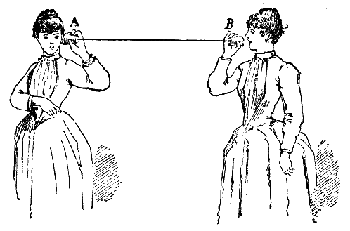

# BONUS

## Exercice 1 : Lecture d'un graphe quelconque 

Voici un graphe :

  

1. Ce grahe est-il orienté ou non orienté ?

2. Combien a-t-il de sommet ?

3. Combien a-t-il d'arrête ?

4. Dresser le tableau des execentricités de chacun des sommets.

5. Indiquer :

  - Le rayon du graphe
  - Le diamètre du graphe
  - Le centre du graphe

  
<u>Correction</u>

  

    <ol>
      <li>Le graphe est non orienté</li>
      <li>6 sommets</li>
      <li>7 arrêtes</li>
      <li> Tableau des excentricités :
        <table>
          <thead>
            <tr>
              <td> Sommet </td>
              <td> Excentricité </td>
            </tr>
          </thead>
          <tr>
            <td> A </td>
            <td> 2 </td>
          </tr>
          <tr>
            <td> B </td>
            <td> 2  </td>
          </tr>
          <tr>
            <td> C </td>
            <td> 2  </td>
          </tr>
          <tr>
            <td> D </td>
            <td> 3  </td>
          </tr>
          <tr>
            <td> E </td>
            <td> 3  </td>
          </tr>
          <tr>
            <td> F </td>
            <td> 3  </td>
          </tr>
        </table>
      </li>
      <li>
        <ul>
          <li>Le rayon est de 2</li>
          <li>Le diamètre est de 3</li>
          <li>Le centre de ce graphe sont les sommets : A, B, C</li>
        </ul>
      </li>
    </ol>
  

## Exercice 2 : Raccordement téléphonique 

  

Un groupe d'amis souhaite organisé un jeu autour d'un moyen de communication rudimentaire, le [téléphone à ficelle](https://fr.wikipedia.org/wiki/T%C3%A9l%C3%A9phone_%C3%A0_ficelle). Pour représenter au mieux qui peut communiquer avec qui, ils ont décidé, avec votre aide de créer une carte avec le prénom de chacun des joueurs, et avec qui ils peuvent discuter.

1) Dessiner le graphe non orienté suivant :

- Adam peut discuter avec Melvin
- Lisa possède 3 téléphones à ficelles, un pour parler avec Henry, un avec Jade, et un dernier avec Zoé
- Jade et Henry peuvent aussi discuter entre eux
- Zoé a beaucoup d'amis, en plus du téléphone avec Lisa, elle a aussi le moyen de communiquer avec Adam et Melvin

2) Si la ficelle du téléphone de Zoé et Lisa se casse, est ce qu'il serait possible pour Melvin de réussir à passer un message de voisin en voisin jusqu'à Henry ?

  
<u>Correction</u>

  

  <ol>
    <li>  </li>
    <li> Non, aucun autre chemin ne permet d'atteindre Henry si la ficelle entre Lisa et Zoé venait à se casser</li>
  </ol>
  

