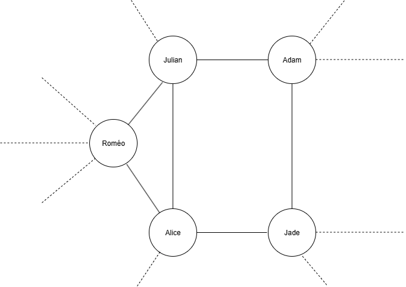
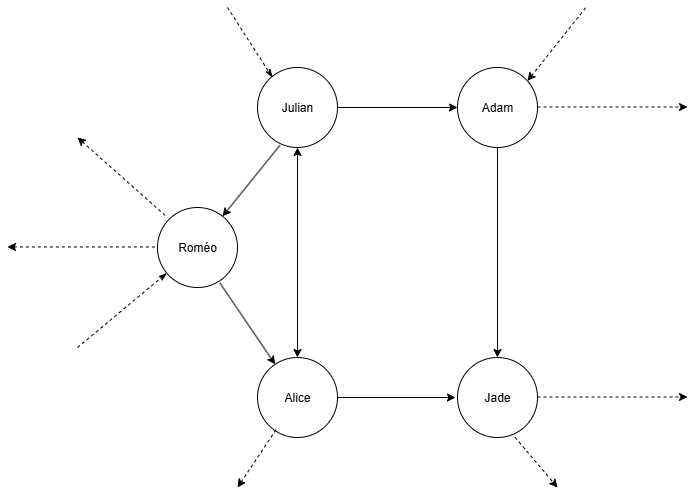

# Graphe

## Vocabulaire

Un graphe non orienté est un ensemble : 

- de **sommets** (ou nœuds), représentés par des ronds. 
- d'**arêtes**, représentées par un trait entre deux sommets.

Un graphe est orienté si les arêtes ont un sens, dans ce cas, on parle plutôt d'arc.  

Pour les graphes non-orientés :

- **Chaîne** de sommets (ou chemin) : Une chaîne de sommets est une suite de sommets consécutifs reliés par des arêtes.
- **Distance** entre deux sommets : La distance entre deux sommets est le plus petit nombre d'arêtes qui permet d'aller d'un sommet à l'autre.
- **Voisinage** : On dit que les **voisins** d’un sommet sont ceux ayant une distance de 1 avec celui-ci.
- **Excentricité** d'un sommet : L'excentricité d'un sommet est la distance du sommet le plus éloigné. Cette distance est calculée en prenant le chemin le plus court. 
- **Rayon** d'un graphe : Le rayon d’un graphe est la plus petite excentricité parmi tous les sommets du graphe.
- **Diamètre** d'un graphe : Le diamètre d’un graphe est la plus grande excentricité parmi tous les sommets du graphe. 
- **Centre** d'un graphe : Le centre d'un graphe est l’ensemble des sommets dont l’excentricité est égale au rayon du graphe.  

Un graphe peut être représenté :
- soit par un **schéma**
- soit par un **tableau d'adjacence** (c'est-à-dire un tableau dont les lignes et les colonnes sont les nœuds)

## Analogie avec un réseau social

Maintenant que les bases du vocabulaire des graphes sont posées, imaginons un réseau social, avec plusieurs millions d'utilisateurs inscrits et utilisant l'application. Chaque utilisateur serait amis avec une ou plusieurs personnes utilisant ce réseau social, et ce lien d'amitié fonctionnerait dans les deux sens, quand je suis amis avec un utilisateur, il est lui même mon amis. 
En partant de cette idée, voici une possibilité de représenté ce réseau social par un graphe, les sommets étant les utilisateurs, et les liens d'amitié les arrêtes : 

  

Ce genre de graphe se rapproche fortement des réseaux sociaux comme Snapchat, Facebook ou encore Discord. 

Dans le cas des réseaux sociaux dont la réciprocité n'est pas nécéssaire pour former un lien entre deux utilisateurs, comme pour Instagram, TikTok ou Twitch, les arrêtes serait remplacés par des arc comme ceci :

  

