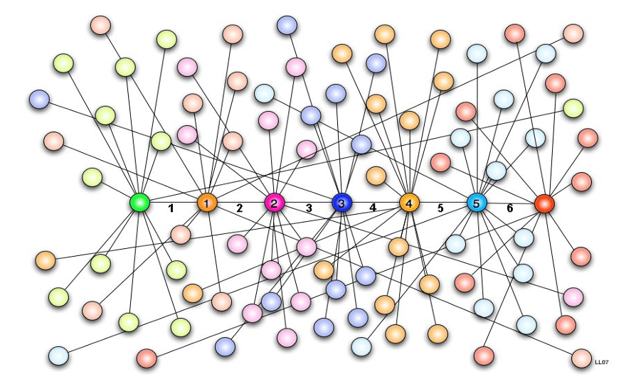

<link rel="stylesheet" href="../assets/style.css" />

# Le "petit monde" de Milgram

Le « phénomène du petit monde » est l'hypothèse que chacun puisse être relié à n'importe quel autre individu par une courte chaîne de relations sociales. L’hypothèse formulé en 1929 par Frigyes Karinthy est que chaque individu sur Terre pourrait être contacté en se servant de ses connaissances proches, et en utilisant pas plus de 5 individus. Cette théorie, appelé « six degrés de séparation » fut démontré grâce l'expérience du petit monde, conduite en 1967 par le psychosociologue Stanley Milgram. 

  
  Graphe représentant les six degrés de séparation

## L'expérience

Milgram a demandé à des participants de différentes régions des États-Unis d’envoyer une lettre à une
personne cible en la passant uniquement à des connaissances personnelles. Milgram a constaté que la
lettre atteignait généralement la cible en six étapes ou moins, d’où l’idée des « six degrés de
séparation ». Cela a soutenu la théorie du « petit monde » et a montré que nous sommes tous beaucoup
plus connectés que nous ne le pensons. 

## De nos jours 

Avec l’arrivé d’Internet et des réseaux sociaux, ce chiffre à tendance à diminuer. En 2011, Facebook
réalise à nouveau l’expérience sur ses utilisateurs de l’époque, soit 721 millions de personnes, et trouve
alors que chaque personne est reliée en moyenne par une chaîne de 4,74 relations à n’importe quelle
autre.