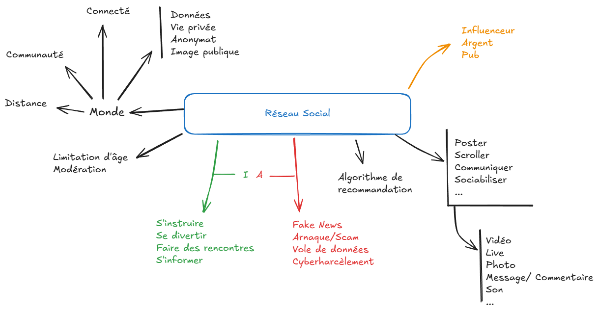

# Réseaux Sociaux 

## Repères historiques

Les réseaux sociaux ont vu une émergence depuis ces deux dernières décennies, permettant à plus de 20 % de la population mondiale de discuter, s'envoyer des photos ou des vidéos, ou partager leur quotidien dans des streams ou des stories. Voici quelques dates associées :

- 1er "vrai" réseau social : **Sixdegree** , 1997
- En France, **Copains d'avant** lance la mode des réseaux sociaux en 2001
- **LinkedIn** est le premier réseau professionel à être créer en 2003
- D'autres réseaux sociaux feront leur apparition par la suite, dont les plus connus continuent d'exister aujourd'hui comme :
  - 4 février 2004 : **Facebook**
  - 16 septembre 2011 : **Snapchat**
  - 6 octobre 2010 : **Instagram**
  - ...

Vous pouvez obtenir plus d'informations sur cette petite vidéo des bons profs sur youtube : [Repères historiques : réseaux sociaux - SNT - Seconde - Les Bons Profs](https://www.youtube.com/watch?v=E6p6zIhYPQw)

## Débat en classe

A la suite des débats en classe, voici une carte mentale "globale" des discussions sur la notion de réseau social. J'ai essayé de reprendre au mieux les idées de toutes les classes de seconde, voici le résultat :

  

## Modèle économique

Cette partie sera traitée en classe. 