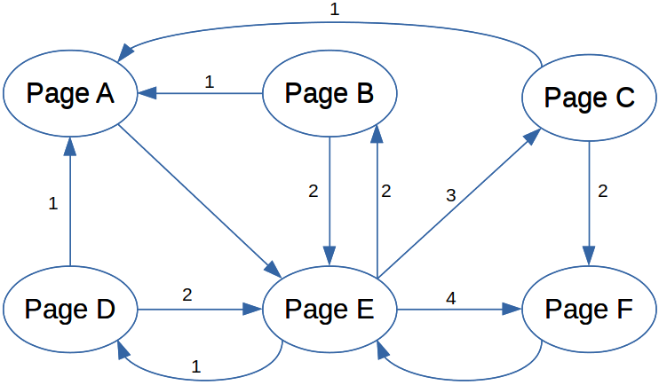

<link rel="stylesheet" href="../../assets/style.css" />
<script src="https://cdn.jsdelivr.net/npm/mathjax@3/es5/tex-mml-chtml.js"></script>


# Moteurs de recherche

## Définition

Un **moteur de recherche** est un **logiciel** qui explore le web de façon à pouvoir proposer des résultats **les plus pertinents** aux **requêtes** des utilisateurs. On peut interroger un moteur de recherche directement **dans la barre d’adresse du navigateur** ou en allant **sur le site du moteur** (google.fr, bing.com…)

## Un peu d'histoire 

Vous pouvez faire plus de recherche à partir de <a href="https://www.youtube.com/watch?v=0A5fQER40Wg">la vidéo du Dr. Nozman sur les moteurs de recherche</a>.

## Fonctionnement

Nous allons voir ici le fonctionnement **très** simplifié d'un moteur de recherche comme Google.

### Exploration et PageRank

Le **robot (« bot »)** d’un moteur de recherche parcourt en permanence le web **en suivant des liens hypertextes**. Lors de son exploration le bot de Google calcule le **PageRank** de chaque page. Actuellement, le PageRank est l’un des nombreux critères qui permet de **classer** les résultats de recherche. Le PageRank représente schématiquement **la probabilité** qu’a un internaute d’arriver sur une page. C’est ce qui a permis à Google de se démarquer de la concurrence à la fin des années 90.   

Nous allons calculer une version simplifiée du PageRank sur un ensemble de 6 pages reliées par des liens représentés par des flèches sur le graphe ci-dessous.  

<div style="display: flex; flex-direction:column;  text-align: center; ">
  
</div>

Pour cela, nous utiliserons l’algorithme suivant :

- Mettre un pion (gomme…) sur une page au hasard ;
- Déplacer le pion sur une autre page en utilisant un lien au hasard ;
- Recommencer l’étape 2 trente fois.

À chaque fois que le pion va sur une page, il faut mettre un bâton dans le tableau ci-dessous. Pour choisir réellement au hasard, on pourra utiliser <a href="https://www.tirokdo.com/tirage-au-sort/nombre-aleatoire" target="_blank"> un générateur de nombre aléatoire en ligne</a>.

2) Compléter le tableau ci-dessous en utilisant l'algorithme précédent.

| Page               | A | B | C | D | E | F |
|--------------------|---|---|---|---|---|---|
| Nombre de visites |   |   |   |   |   |   |

3) Grâce à vos résultats et à ceux de vos camarades, calculer la probabilité (sous forme d’un pourcentage) de tomber sur chacune des pages. Noter vos résultats dans le tableau ci-dessous :

| Page               | A | B | C | D | E | F |
|--------------------|---|---|---|---|---|---|
| Proba de visite |   |   |   |   |   |   |	


4) Quelle est la page qui a le plus grand PageRank ? Pour quelle raison simple ?

## Les pages web

### URL

URL signifie **Uniform Ressource Locator**. On assimile souvent URL avec adresse web alors qu’il peut exister des URL pour des ressources qui ne sont pas sur le web (FTP, mail…).  

Une adresse web a une URL qui commence par `http://` pour **HyperText Transfer Protocol**. C’est la base du **World Wide Web** inventé par Tim Berners-Lee en 1989.

Prenons pour exemple une URL pour en comprendre toutes les parties :

```
https://www.debian.org/intro/about
```

Sur l’URL ci-dessus on peut distinguer :

- `https` : le protocole, il est avant le séparateur. Dans le cas du web il sera toujours http ou https ;
- `://` : le séparateur ;
- `www.debian.org` : le nom de domaine/sous-domaine. Il se situe entre le séparateur et le premier `/` ;
- `/intro/about` : le chemin vers la ressource.

1) Sur l’URL ci-dessous, déterminer le protocole, le domaine/sous-domaine et le chemin vers la ressource.

```
https://www.gnu.org/philosophy/philosophy.fr.html
```

2) Donner l’URL de la page Wikipedia sur Tim Berners-Lee.

Le chemin vers la ressource suit l’arborescence du serveur. `/` est la racine du serveur et `/intro/` correspond au dossier « intro » sur le serveur.

3) Donner l’URL du dossier « devel » sur le serveur <a href="www.debian.org" target="_blank">www.debian.org </a>.

### Modèle client / serveur

Pour obtenir le contenu d’une URL, **un navigateur** (le client) envoie **une requête** à **un serveur** et il attend sa réponse. Le serveur répond en envoyant **certaines informations (ce qu'on appelle les « en-têtes »)** et le **contenu** de l’URL demandée.  

Pour voir les requêtes dans Firefox il faut appuyer sur `F12`, puis l'onglet "network" ou `Ctrl + Maj + E` puis cliquer sur la première ligne de la liste qui apparaît. Il sera nécessaire de **rafraîchir la page** et de choisir la requête que l'on veut observer. On s'intéressera particulièrement **aux entêtes (headers)** des requêtes.

4) En allant sur la page du tp  <a href="https://profcardoso.github.io/cours_seconde/web/moteur_de_recherche_2.html" target="_blank">https://profcardoso.github.io/cours_seconde/web/moteur_de_recherche_2.html</a> , observer la requête envoyée et la réponse pour url-requete-http puis compléter les informations ci-dessous :

- méthode de la requête (GET ou POST) ;
- code d’état renvoyé par le serveur ;
- type de contenu (content-type) de la réponse  ;
- logiciel du serveur (Server)  ;
- taille de la réponse (Content-Length) ;
- navigateur du client (dans le User-Agent)  ;
- système d’exploitation du client (dans le User-Agent) 

### HTTPS

**HTTPS** est une amélioration du **protocole HTTP** qui permet de **crypter** les échanges d’informations entre le client et le serveur. C’est à dire qu’une personne qui intercepterait votre communication ne pourrait pas la comprendre. En cherchant sur internet ou avec l'aide du prof, répondre aux questions suivantes :

5) Que veut dire le « s » de HTTPS ?

6) Comment reconnaît-on facilement qu’une page est en HTTPS ?

7) De quel élément, signé par un tiers de confiance, le protocole https a-t-il besoin pour fonctionner ?
