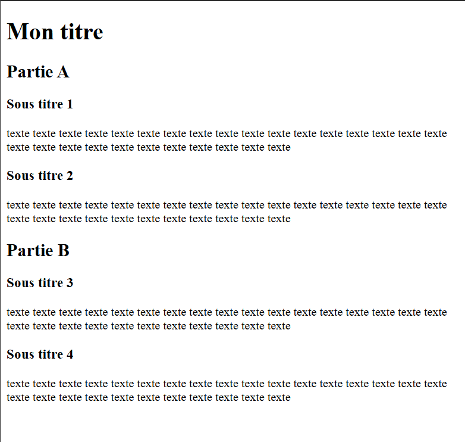

<link rel="stylesheet" href="../../assets/style.css" />
<script src="https://cdn.jsdelivr.net/npm/mathjax@3/es5/tex-mml-chtml.js"></script>

# Comment créer un petit site web ?

## Le langage HTML

Le **HyperText Markup Language**, généralement abrégé **HTML** ( ou, dans sa dernière version, HTML5) , est le **langage de balisage** conçu pour écrire les pages web. Il s'agit d'un format ouvert très utilisé en informatique.

### Une première page

Pour découvrir le langage HTML, nous allons utiliser le site web suivant : <a href="https://jsfiddle.net/" target="_blank">jsfiddle.net/ </a>. Ce site web permet de regrouper sur une même page le fichier HTML, CSS ( pour décorer vos pages) et JavaScript ( pour faire des interactions) , ainsi qu'un rendu de la page au fur et à mesure de la construction de ce dernier.  

Si vous possèdez un éditeur de fichier, comme **Visual Studio Code**  ou **Notepad ++** , vous pouvez les utiliser pour modifier vos fichiers.

> 👉 Travail à faire n° 1 :
>
> Ouvrir le navigateur, la page de jsfiddle.net et copier le code suivant dans la partie html.
> 
```html
<h1>Mon titre</h1>
<h2>Un sous-titre</h2>
<p>
    Ceci est un paragraphe. Et un élément <strong>important</strong>.
</p>
```
>
> 1. Quelle(s) balise(s) permet de créer des titres ? 🖋️
>
> 2. Quelle balise permet de créer des textes ? 🖋️
>
> 3. Qu'est-il arrivé au mot "important" ? 🖋️
 
> 👉 Travail à faire n° 2 :
>
> En utilisant les balises h1, h2, h3, ainsi que la balise p, construire la page ci-dessous :

<div style="display: flex; flex-direction:column;  text-align: center; ">
  
</div>

>
> En utilisant les balises  `em`, `strong`, `sup` et `sub` mettre en valeur quelques lettre et/ou mot du texte de la page.

### Les listes, les liens et les images

Les listes se font grâce aux balises `<ul>` ou `<ol>`. Les éléments d’une liste sont défini par la balise `<li>`.


> 👉 Travail à faire n° 3 :
>
> Saisissez le code suivant dans votre page :
>
```html
<ul>
    <li>un élément</li>
    <li>un deuxième élément</li>
    <li>un autre élément</li>
</ul>

<ol>
    <li>un élément</li>
    <li>un deuxième élément</li>
    <li>un autre élément</li>
</ol>
```
>
> 4. Quelle est la différence entre `<ul>` et `<ol>` ?

---

Pour faire un **lien hypertexte** il faut utiliser la balise `<a>`. Son contenu est le texte cliquable et on lui ajoute un attribut `href` pour indiquer la cible du lien.

*Exemple :* 

```html
<a href="https://www.google.fr">Lien vers Google</a>
```

---

Pour ajouter une image, on utilisera la balise `` sans balise fermante. Un attribut `src` permettra d’indiquer **l’url** de l’image, qu’elle soit **locale** ou **sur internet**.

*Exemple :* 

```html

```

> 👉 Travail à faire n° 4 :
>
> 5. Cherchez une célébrité de votre choix sur Wikipédia, copiez l'adresse URL de la page et faites un lien depuis votre site web pour accéder par un clic à la page de cette dernière.
>
> 6. Après avoir cherché une image sur internet et copié son URL, ajoutez une image à votre site web.


## La mise en forme

Le **CSS (Cascading Style Sheets, ou feuilles de style en cascade)** est un **langage de feuille de style** et non un langage de programmation classique, utilisé pour décrire la présentation visuelle des documents écrits en HTML.  Il permet de séparer la structure du contenu (gérée par le HTML) de son style et de sa mise en page, en définissant des règles pour les couleurs, les polices, les espacements, les bordures et le positionnement des éléments. 

### Quelques bases 

Pour appliquer un style à un élément il faut écrire des instructions dans la fenêtre CSS à droite.

> 👉 Travail à faire n° 5 :
>
> Ajoutez le code suivant dans la fenêtre CSS et décrire ce qu’il se passe :
```css
h1 {
    text-align: center;
    color: red;
}

p {
    background-color: green;
}
```
>

### Mettre en pratique

> 👉 Travail à faire n° 6 :
>
> Mettre la page précédente en forme selon vos goûts.

## Pour les plus rapides

D'autres balises pour créer les pages existent et sont parfois très importantes ! En utilisant ce site web : <a href="https://developer.mozilla.org/fr/docs/Learn_web_development/Core/Structuring_content/Basic_HTML_syntax" target="_blank"> Syntaxe de base du html</a> ,cherchez d'autres balises et testez les dans votre page web.