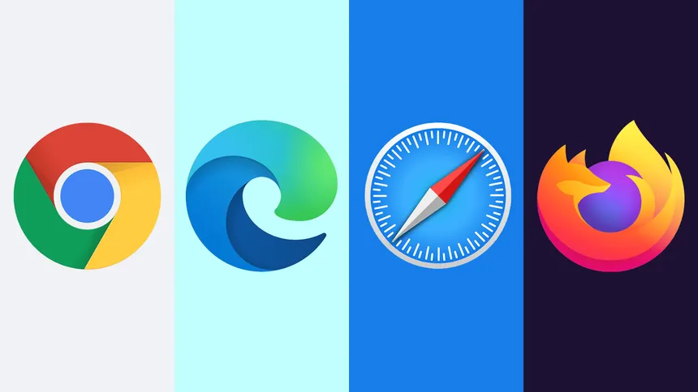
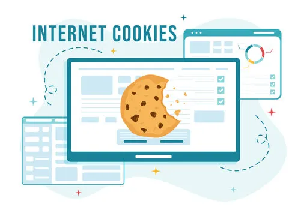

<link rel="stylesheet" href="../../assets/style.css" />
<script src="https://cdn.jsdelivr.net/npm/mathjax@3/es5/tex-mml-chtml.js"></script>


# Le Web

## Introduction

Le **Web (toile ou réseau)** désigne un **système donnant accès à un ensemble de données (page, image, son, vidéo)** reliées par des **liens hypertextes** et accessibles sur le réseau internet.

## Repères historiques 

- **1965 :** invention et programmation du **concept d’hypertexte** par **Ted Nelson** ; 
- **1989 :** naissance de l'hypertexte au **CERN** par **Tim Berners Lee**. Première <a href="https://info.cern.ch/hypertext/WWW/TheProject.html" target="_blank"> page web</a> au monde créé au CERN.
- **1993 :** mise dans le domaine public, disponibilité du premier navigateur **Mosaic** ; 
- **1995 :** mise à disposition de technologies pour le développement de site Web **interactif** (langage JavaScript) et **dynamique** (langage PHP) ; 
- **2001 :** standardisation des pages grâce au **DOM** (Document Object Model) ; 
- **2010 :** mise à disposition de technologies pour le développement d’applications sur mobiles. 

## Qu’est-ce qu’un ordinateur ?

Un ordinateur est une machine électronique programmable.

- **Hardware** : c’est la partie matérielle (machine) de l’ordinateur (carte mère, processeur, mémoire…).
- **Software** : c’est la partie logicielle (programmable) de l’ordinateur (LibreOffice, Firefox…).
- **Système d’exploitation** : est un logiciel qui fait le lien entre le software et l’hardware (Windows, MacOS, Linux…).

1) Pour chacun des éléments suivants indiquer s’il s’agit d’hardware, de software ou d’un système d’exploitation :

- disque dur ;
- Discord ;
- souris ;
- Microsoft Windows 11 ;
- Chrome ;
- Ubuntu.

## Bureautique

La mémoire d’un ordinateur est organisée en une arborescence de dossiers contenant des fichiers.

```
Documents
└── SNT
	├── Dossier 1
	│	├── Dossier 2
	│	│	└── Fichier2.txt
	│	└── Dossier3
	├── Dossier 3
	│	└── Fichier3.txt
	└── Fichier1.txt
```
L’origine de cette arborescence est appelée **racine.** Sous Windows la racine est `C:\` et sous Linux `/`.

2) Vérifier que vous possèdez bien un dossier SNT dans vos dossiers personnel.

## Sauvegardes

Il est très important de faire des sauvegardes de son travail. Au lycée il est préférable (obligatoire) d'enregistrer dans votre répertoire de travail.

Il est même plus prudent de sauvegarder sur plusieurs supports différents (clé USB, pearltrees, cloud…) vos fichiers importants. Voir l’histoire de <a href="https://cryptonaute.fr/bitcoins-perdus-a-tout-jamais-dans-une-decharge/" target="_blank"> James Howells</a>

## Navigateurs

<div style="display: flex; flex-direction:column;  text-align: center; ">
  
</div>


### Introduction

Un **navigateur** est un **logiciel** qui permet d’aller sur le web en **affichant le contenu de la page web** dont **l’adresse est dans la barre d’adresse**.

Il existe de nombreux navigateurs, avec leurs avantages et leurs inconvénients.

3) Donner le nom des navigateurs appartenant aux sociétés suivantes :

- Google ;
- Mozilla ;
- Apple ;
- Microsoft.

4) Trouver au moins deux autres navigateurs.

## Vie privée et sécurité

Lorsque vous allez sur internet vous êtes suivi à plusieurs niveaux. Il faut savoir comment s’en protéger.

### Historique de navigation

En général, le navigateur garde votre historique de navigation car cela lui permet de vous suggérer des pages.

Pour visualiser votre historique il faut faire `Ctrl + h` sur votre clavier, ou cliquez sur le menu de votre navigateur, puis "Historique".

5) Visualisez votre historique

On peut avoir envie de ne pas conserver notre historique ou de le supprimer. Pour cela il faut aller dans le menu « vie privée et sécurité » des paramètres de Firefox. Trouvez comment supprimer votre historique.

### Confidentialité et sécurité dans Brave

6) Supprimez votre historique.

### Navigation privée ...

Il est possible d’utiliser le navigateur dans un « mode » spécial qui n’enregistre absolument rien : c’est le **mode navigation privée**. Pour y accéder, faite le combo de touche `Ctrl + Shift + n`, ou allez dans le menu de votre navigateur et cliquez sur la ligne « Nouvelle fenêtre privée ». Ainsi quand vous fermerez cette fenêtre du navigateur il ne restera aucun trace de votre passage.

7) Visitez quelques site dans la fenêtre de navigation privée puis fermez cette fenêtre et allez voir votre historique. Que constatez-vous ?

### Navigation cachée ?

8) Quand vous utilisez la navigation privée, êtes-vous certain que personne ne pourrait connaître les sites que vous avez visités ? Qui peut le savoir ?

9) Connaissez-vous une solution pour contourner ce problème ? Est-elle parfaite ?

## Cookies / Traqueurs

<div style="display: flex; flex-direction:column;  text-align: center; ">
  
</div>
<br>

Les cookies sont de petits fichiers texte déposés par différents sites pour vous reconnaître. Ils peuvent servir à différentes choses.

10) Allez sur le site de l’ENT (ent.fr) et connectez-vous. Allez ensuite dans le même menu « confidentialité et sécurité » de Firefox et supprimez votre historique en incluant les cookies. Retournez sur le site de l’ENT. Que constatez-vous ? Quelle peut-être l’utilité des cookies ?

11) Après avoir effacé tous les cookies puis navigué sur vos sites préférés (en autorisant les cookies), allez voir la liste des cookies que vous avez récoltés. Il faut aller dans « Cookies et données des sites » puis cliquer sur « Gérer les données… ». Que constatez-vous sur l’origine des cookies présents sur votre ordinateur ?
